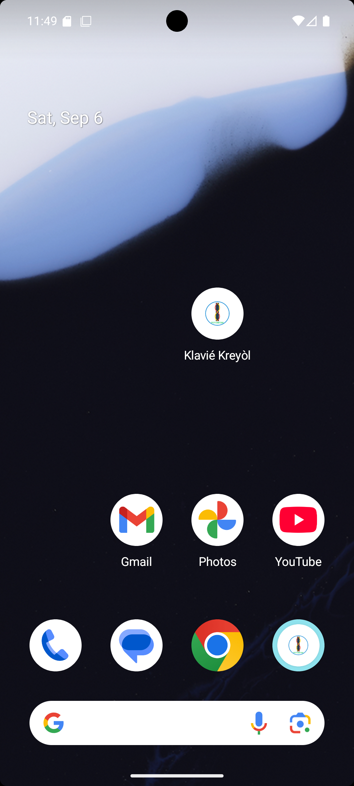
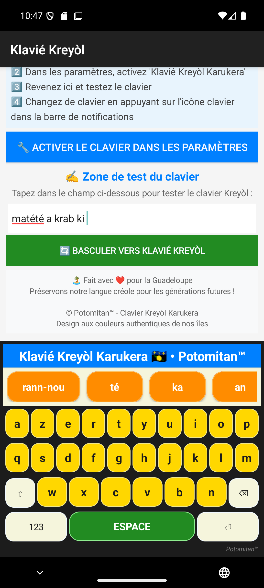

#  Klavyé Kréyòl Karukera : Clavier intelligent pour la saisie en **kréyòl Guadeloupéen** avec suggestions de mots.

[](https://play.google.com/store/apps/details?id=com.potomitan.kreyolkeyboard&referrer=utm_source%3Dgithub%26utm_campaign%3Dlaunch10k)
[](https://famibelle.github.io/KreyolKeyb/ambassade.html)

> 🎯 **Objectif : 10 000 téléchargements** — la jauge ci-dessus progresse chaque jour. [Devenez ambassadeur](https://famibelle.github.io/KreyolKeyb/ambassade.html) : contacts des médias locaux et messages prêts à envoyer.

**Klavyé Kréyòl Karukera** est un clavier Android intelligent conçu pour répondre à un besoin fondamental : permettre aux Guadeloupéens d’écrire facilement en **Kréyòl Guadeloupéen** sur leur smartphone, avec fluidité, authenticité et fierté.


- 🛠️ Si ton créole est très rouillé...
- 😤 Que tu galères à écrire en kréyòl parce que ton téléphone refuse tous les mots
- 🤔 Que tu doutes de l’orthographe à chaque message ...
- ➡️ Klavyé Kréyòl Karukera est fait pour toi !


Ce projet s’appuie sur un **corpus littéraire créole** et les travaux de **grands défenseurs du kréyòl** — écrivains, chanteurs, linguistes — pour offrir une expérience de saisie fidèle à la richesse de la langue.

Grâce à un dictionnaire de plus de **1 800 mots** et un système de **suggestions contextuelles** basé sur des textes d’auteurs emblématiques tels que :

- 🎤 **Esnard Boisdur**, **Jomimi**, **Pierre Edouard Decimus** – artistes et conteurs qui ont fait vibrer le créole à travers la musique et la tradition orale  
- ✍️ **Sonny Rupaire**, **Silvyane Telchid**, **Max Rippon**, **Gisèle Pineau**, **Katel** – écrivains et poètes qui ont donné au kréyòl ses lettres de noblesse  
- 📚 **Robert Fontes**, **Alain Verin**, **Alain Rutil**, **Benjamin_Moïse** – linguistes et chercheurs qui ont structuré et valorisé la langue

🧠 Le dictionnaire est en **évolution permanente**, enrichi régulièrement grâce aux **suggestions de la communauté créolophone**. Chaque contribution aide à affiner les prédictions et à refléter les usages réels du kréyòl contemporain.

⚡ Grâce à ces suggestions basées sur les plus grands textes en kréyòl, les utilisateurs peuvent **écrire très rapidement dans un kréyòl fluide, riche et parfaitement maîtrisé**, sans effort ni approximation.

📱 Compatible Android 7.0+, il s’installe facilement et fonctionne avec toutes les applications de messagerie, réseaux sociaux ou saisie web.

---

**Klavyé Kréyòl Karikera**, c’est plus qu’un outil :  
C’est un acte de transmission, un hommage à la langue, une technologie au service de l’identité créole.


## 📱 Aperçu

<div align="center">
   
</div>

*Clavier créole avec suggestions basés sur les textes littéraires fondateurs du kréyòl*

## 🌟 Fonctionnalités

### 🎯 **Suggestions Intelligentes**
- **1 867 mots** créoles dans le dictionnaire
- Suggestions contextuelles en temps réel
- Prédiction de texte adaptée au kréyòl
- **N-grams linguistiques** construits à partir de textes authentiques créoles

#### 📚 **Corpus Littéraire des Suggestions**
Les suggestions de mots sont générées grâce à des **N-grams** (séquences de mots) extraits des œuvres d'éminents auteurs et contributeurs de la littérature créole guadeloupéenne :

**Auteurs et Contributeurs** :
- **Robert Fontes** - Linguiste et lexicographe créole
- **Silvyane Telchid** - Romancière et dramaturge
- **Sonny Rupaire** - Poète et militant culturel
- **Max Rippon** - Écrivain et chroniqueur
- **Alain Rutil** - Auteur et chercheur créolophone
- **Germain William** - Conteur et écrivain traditionnel
- **Alain Verin** - Linguiste spécialiste du créole
- **Katel** - Artiste et poète contemporain
- **Esnard Boisdur** - Écrivain et journaliste
- **Pierre Edouard Decimus** - Auteur et intellectuel
- **Jomimi** - Conteur et Joueur de Ka 🪘


Cette approche garantit des suggestions **authentiques** et **culturellement appropriées**, respectant les nuances et la richesse du **kréyòl Guadeloupéen** contemporain.


### 🎨 Design
- Palette inspirée (Bleu Caraïbe / Jaune Soleil / Vert Canne / Rouge Hibiscus)
- Touches arrondies, animations 100–120 ms, haptique légère
- Watermark discret Potomitan™

## 📦 Téléchargements

### 🚀 **Dernière Version Stable**

[](https://github.com/famibelle/KreyolKeyb/releases/latest)
[](https://github.com/famibelle/KreyolKeyb/releases)

### 📱 **Installation Rapide**

1. **Téléchargez l'APK** depuis la [dernière release](https://github.com/famibelle/KreyolKeyb/releases/latest)
2. **Autorisez les sources inconnues** dans les paramètres Android
3. **Installez l'APK** en touchant le fichier
4. **Activez le clavier** dans Paramètres → Système → Langues et saisie

### 📦 **Types d'APK Disponibles**

| Type | Description | Taille | Usage |
|------|-------------|--------|-------|
| **Release APK** | Optimisée production | ~2–3 MB | ✅ Recommandé |
| **Debug APK** | Avec logs verbeux | + ~1 MB | 🔧 Dev |

### 🔄 **Mises à Jour Automatiques**

Les nouvelles versions sont automatiquement construites et publiées grâce à **GitHub Actions** :
- ✅ **Build automatique** à chaque push sur `main`
- ✅ **APK signés** prêts pour l'installation
- ✅ **Releases automatiques** sur [GitHub Releases](https://github.com/famibelle/KreyolKeyb/releases) à chaque tag `v*.*.*`

### 🔧 Compilation (sources)
```bash
git clone https://github.com/famibelle/KreyolKeyb.git
cd KreyolKeyb/android_keyboard
./gradlew assembleRelease
```

## �️ Installation depuis les sources

### Prérequis
- **Android 7.0** (API 24) ou supérieur
- **10 MB** d'espace libre

### Installation depuis les sources

1. **Cloner le repository** :
```bash
git clone https://github.com/famibelle/KreyolKeyb.git
cd KreyolKeyb/android_keyboard
```

2. **Compiler l'APK** :
```bash
./gradlew assembleDebug
```

3. **Installer sur device** :
```bash
./gradlew installDebug
```

4. **Activer le clavier** :
   - Aller dans **Paramètres** → **Système** → **Langues et saisie**
   - Sélectionner **Claviers virtuels**
   - Activer **Clavier Créole Guadeloupéen**
   - Définir comme clavier par défaut

## 🚀 Utilisation

### Activation
1. Ouvrir n'importe quelle application de saisie
2. Appuyer longuement sur l'icône clavier (barre de navigation)
3. Sélectionner **Clavier Créole Guadeloupéen**

### Accents
Appui long sur une lettre: affiche un popup (ex: a → à á â ä ã …). Relâcher après sélection.

### Suggestions de Mots
- Commencer à taper un mot créole
- Les suggestions apparaissent automatiquement
- Toucher une suggestion pour l'insérer

## 🏗️ Architecture

### Structure du Projet
```
android_keyboard/
├── app/src/main/
│   ├── java/com/example/kreyolkeyboard/
│   │   ├── KreyolInputMethodService.kt   ← IME principal (gestion touches / suggestions / accents)
│   │   ├── SettingsActivity.kt           ← UI d’activation & onboarding
│   │   └── KreyolSpellCheckerService.kt  ← (placeholder – à implémenter ou supprimer)
│   ├── assets/
│   │   ├── creole_dict.json              ← Liste [mot, fréquence]
│   │   └── creole_ngrams.json            ← Modèle N-grams (predictions)
│   └── res/…                             ← Ressources UI (couleurs, dimens, drawables, styles)
└── gradle/                               ← Wrapper Gradle
```

### Technologies Utilisées
- **Kotlin** - Langage principal
- **Android InputMethodService** - Framework IME
- **JSON** - Format du dictionnaire et N-grams
- **Gradle** - Build system
- **Material Design** - Guidelines UI/UX
- **GitHub Actions** - CI/CD automatisé

## 📚 Dictionnaire & Prédiction

### Sources du Dictionnaire
Le dictionnaire contient **1 867 mots créoles** extraits de :

1. **Dataset Potomitan** (Hugging Face)
   - Corpus de traductions français-créole
   - Validation linguistique professionnelle

2. **Textes Littéraires Créoles** 🐚
   - Œuvres de Gisèle Pineau
   - Poésie de Sonny Rupaire
   - Chansons traditionnelles guadeloupéennes �
   - Littérature créole contemporaine

### Mots les Plus Fréquents
```
an (424), ka (324), la (219), on (208), té (188)
pou (154), nou (133), i (102), sé (100), yo (94)
```

### Mise à jour dictionnaire
```bash
python Dictionnaire.py            # (Hugging Face, nécessite connexion internet)
python GenererNgrams.py           # produit assets N-grams
```

## 🎨 Design & UX

### Palette de Couleurs
- **Bleu Caribbean** : `#1E88E5` (touches principales)
- **Jaune Soleil** : `#FFC107` (accents)
- **Rouge Hibiscus** : `#E53935` (actions)
- **Vert Tropical** : `#43A047` (confirmations)

### Logo Potomitan™
- Logo officiel intégré dans l'interface
- Représentation de l'héritage culturel guadeloupéen
- Design moderne et respectueux

## 🧪 Validation

### Tests Effectués
- ✅ Saisie de texte en créole
- ✅ Suggestions de mots fonctionnelles
- ✅ Accents et caractères spéciaux
- ✅ Basculement modes alphabétique/numérique
- ✅ Compatibilité applications courantes
- ✅ Performance et fluidité

Tests informels sur: SMS, messageries, réseaux sociaux, champs web, saisie mail.

## 🤝 Contribution

### Comment Contribuer
1. **Fork** le projet
2. Créer une **branch feature** (`git checkout -b feature/AmeliorationClavier`)
3. **Commit** les changements (`git commit -m 'Ajout nouvelle fonctionnalité'`)
4. **Push** vers la branch (`git push origin feature/AmeliorationClavier`)
5. Ouvrir une **Pull Request**

### Développement Local
```bash
# Cloner le repo
git clone https://github.com/famibelle/KreyolKeyb.git

# Setup environnement
cd KreyolKeyb/android_keyboard
./gradlew build

# Tests
./gradlew test
```

## 📖 Détails techniques clés

### API IME Android
- `InputMethodService` - Service principal
- `InputConnection` - Interface application
- `KeyboardView` - Affichage clavier personnalisé

### Suggestion
- Combinaison: préfixe dictionnaire + N-grams contextuels + fallback mots fréquents.
- Nettoyage historique limité (FIFO 5 derniers mots).
- Ajout dynamique au UserDictionary (si disponible) pour réduire soulignement rouge.

## 🌍 Langue & Culture

### kréyòl Guadeloupéen
Le **kréyòl Guadeloupéen** est une langue créole parlée en Guadeloupe, qui prend sa source dans une culture africaines, caribéennes et amérindiennes.

### Respect Culturel �
Ce projet est développé dans le respect de :
- La richesse linguistique caribéenne
- L'héritage culturel guadeloupéen
- Les normes d'écriture créole établies
- La communauté créolophone

## 📄 License

Distribué sous licence **MIT**. Voir `LICENSE` pour plus d'informations.

## 👥 Auteurs

### Développement
- **Medhi** - Développeur principal
- **Potomitan™** - [potomitan.io](https://potomitan.io/)

### Remerciements
- Communauté créolophone guadeloupéenne
- Contributeurs du dataset Potomitan
- Auteurs des textes littéraires créoles
- Beta-testeurs et utilisateurs

## 📞 Support

### Contact
- **Email** : support@potomitan.io
- **GitHub Issues** : [Ouvrir un ticket](https://github.com/famibelle/KreyolKeyb/issues)

### FAQ
**Q: Comment changer la langue du clavier ?**
R: Aller dans Paramètres → Langues et saisie → Claviers virtuels

**Q: Les suggestions ne fonctionnent pas ?**
R: Vérifier que le clavier est bien activé et défini par défaut

**Q: Comment régénérer les données linguistiques ?**
R: Exécuter `Dictionnaire.py` puis `GenererNgrams.py`.

<div align="center">
   
   
</div>

---

<div align="center">

** Fierté Guadeloupéenne – Technologie au service de la langue **

*Développé avec ❤️ pour la communauté créolophone* 🐚�

</div>


