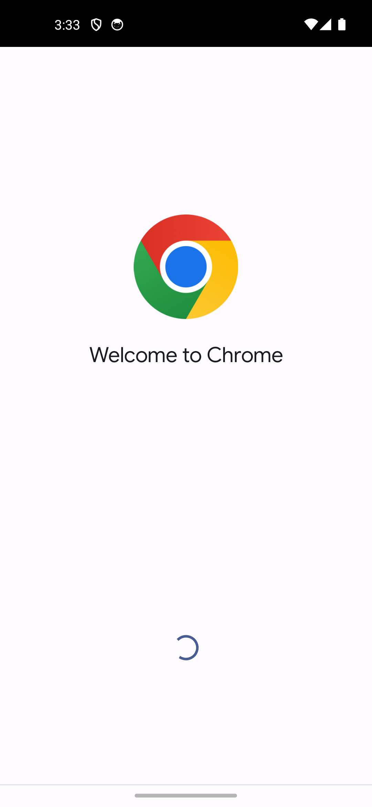

# Améliorations du tunnel d'activation — 11 juillet 2026

Suite au rapport `rapport_onboarding_activation_2026-07-11.md`, 5 des 7 recommandations ont été implémentées et vérifiées sur émulateur (`kreyol_test`, premier lancement reproduit à l'identique : désinstallation + désactivation forcée de l'IME côté système). La recommandation #7 (`directBootAware`) reste volontairement hors scope (implications sécurité à évaluer séparément).

## 1. Carte explicative avant l'avertissement système Android

Une carte apparaît désormais dans l'onglet Démarrage, tant que le clavier n'est pas activé, expliquant que l'avertissement système est standard pour tout clavier tiers et pointant vers la politique de confidentialité.

Le lien ouvre bien la politique de confidentialité dans le navigateur :

## 2. Lien vers la politique de confidentialité dans « À Propos »

Nouvelle carte « 🔒 Confidentialité » ajoutée à l'onglet À Propos, avec le même lien.

## 3. Nom du clavier non tronqué dans les listes système

`keyboard_name`/`subtype_kreyol` raccourcis de « Klavyé Kréyòl Karukera Potomitan™ » à « Klavyé Kréyòl Karukera » — le nom s'affiche désormais en entier dans les paramètres système.

## 4. Confirmation de succès + tip contextuel au premier usage réel

Un `Toast` unique (« Kréyòl a klavyé a ! Apiyé lontan asi on lèt pou wè aksan yo... ») se déclenche la première fois que le clavier est utilisé réellement en dehors de l'app elle-même (détecté via `EditorInfo.packageName`, flag `SharedPreferences` posé une seule fois). Vérifié fonctionnellement : le flag `first_real_use_tip_shown` se pose bien lors de la première frappe dans Google Messages, jamais dans le champ de test intégré à l'app.

## 5. Suppression du code mort

`createActivationBanner()` et `createStatusBar()` — deux fonctions de statut jamais appelées — retirées de `SettingsActivity.kt`.

## Fiche Play Store

`KreyolKeybPlayStore/texts/description.md` complétée avec le lien vers la politique de confidentialité et le rappel explicite des 3 étapes d'activation (Paramètres > Langues et saisie > Claviers virtuels).

## Vérification

Build + suite de tests unitaires au vert après chaque changement. Parcours complet rejoué manuellement sur l'émulateur `kreyol_test` (état vierge reproduit).
