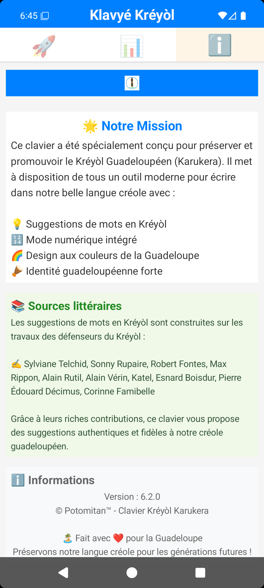
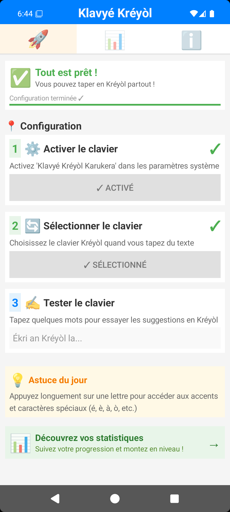

<nav class="site">
  <strong>🏠 Accueil</strong> ·
  <a href="ambassade.html">📣 Vin Anbasadè</a> ·
  <a href="presskit.html">📰 Presse</a> ·
  <a href="https://play.google.com/store/apps/details?id=com.potomitan.kreyolkeyboard&referrer=utm_source%3Dlanding%26utm_campaign%3Dlaunch10k">📲 Télécharger</a> ·
  <a href="https://github.com/famibelle/KreyolKeyb">💻 GitHub</a> ·
  <button type="button" class="theme-toggle" aria-label="Changer de thème">🌙</button>
</nav>

# Klavyé Kréyòl Karukera, le clavier créole guadeloupéen pour Android

**Écrire en kréyòl sur son téléphone, sans galérer.** Klavyé Kréyòl Karukera
est un clavier Android **gratuit, open source, zéro pub et 100 % hors ligne** qui
propose des suggestions de mots en **créole guadeloupéen**, construites sur
les textes des grands défenseurs du kréyòl : Sylviane Telchid, Sonny Rupaire,
Max Rippon, Robert Fontes, Esnard Boisdur et bien d'autres.

  

## Le clavier en action

   
   
   

## Pourquoi ce clavier ?

- 🤔 Ton téléphone **refuse tous les mots créoles** et « corrige » ton kréyòl en français ?
- 😤 Tu **doutes de l'orthographe** à chaque message ?
- ➡️ Klavyé Kréyòl Karukera est fait pour toi.

## Fonctionnalités

| | |
|---|---|
| 💡 **Suggestions intelligentes** | Dictionnaire de 1 800+ mots créoles et modèle de prédiction construit sur un corpus littéraire créole authentique |
| 🔤 **Accents faciles** | Appui long sur une lettre pour é, è, à, ò et tous les caractères du kréyòl |
| 🇫🇷 **Bilingue** | Le français prend le relais quand aucun mot créole ne correspond |
| 🎮 **Jeux de vocabulaire** | Mots Mêlés et Mots Mélangés pour apprendre en s'amusant |
| 🏆 **Progression culturelle** | 8 niveaux, de Pipirit à Benzo, au fil de tes mots tapés |
| 🔒 **Zéro collecte de données** | Fonctionnement 100 % local : rien ne quitte ton téléphone ([politique de confidentialité](privacy/privacy-policy.html)) |
| 🚫 **Zéro pub** | Aucune publicité, aucun tracker : le clavier reste concentré sur l'essentiel |
| 🆓 **Gratuit et open source** | Code public sur [GitHub](https://github.com/famibelle/KreyolKeyb), licence MIT |

## Un projet de préservation linguistique

Le créole est parlé par **1,6 million de locuteurs en France**. Et pourtant
sa place institutionnelle reste fragile : en octobre 2025, il a même été
retiré de l'agrégation des langues de France, déclenchant une mobilisation
des enseignants et des élus.

Ce n'est donc pas juste un clavier : **chaque message écrit en kréyòl aide
notre langue à exister** dans le numérique, là où elle se joue désormais
chaque jour. Le dictionnaire et les suggestions s'appuient sur les œuvres
d'écrivains, de linguistes et d'artistes qui ont donné au créole
guadeloupéen ses lettres de noblesse.

## Un écosystème créole plus large

Klavyé Kréyòl Karukera fait partie de l'écosystème **Potomitan™**, qui
développe aussi [POTOMITAN](https://potomitan.io), un traducteur
français ↔ créole guadeloupéen pensé pour les urgences et les démarches
administratives (soutenu par la Préfecture de Guadeloupe via Lab'An Nou,
présenté par Orange Antilles-Guyane). Deux outils, une même mission :
faire vivre le kréyòl dans le numérique, à l'écrit comme à l'oral.

## La jauge des 10 000 📲

  

    … <small style="font-size:14px;font-weight:400;color:var(--ink-soft);">téléchargements · prochain palier : …</small>
    Objectif du jour : 60 📲
  

  

    

  

  

    An nou ay ! Chaque téléchargement fait vivre le kréyòl 🏝️
    Objectif final : 10 000 · 
  

## Vin Anbasadè ! 📣

**Vous voulez aider le kréyòl à rayonner ?** Notre page ambassadeurs vous
donne tout : les contacts des médias locaux, les emails pré-remplis en un
clic, quoi dire si vous appelez une radio, et une affiche à imprimer pour
la laisser chez le boulanger, le pharmacien ou la boutique du coin.

  <a href="ambassade.html" class="btn primary" style="padding:12px 28px;">🏝️ Devenir ambassadeur du Klavyé Kréyòl</a>
  <a href="tract.html" class="btn" style="padding:12px 28px;">🖨️ Imprimer le tract</a>

**Pou laprès :** [dossier de presse / press kit](presskit.html)

## Contacts

Une question, une proposition, un partenariat ? Écrivez à
**[contact@potomitan.io](mailto:contact@potomitan.io)**.

Le code source est ouvert et public sur
[GitHub](https://github.com/famibelle/KreyolKeyb).

---

🏝️ *Potomitan™, Teknoloji pou tout moun.
« An kréyòl nou ka palé, an kréyòl nou ka maké ! »*
