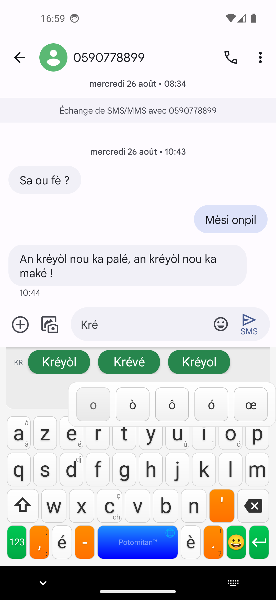

<!-- nav:start -->
<nav class="site">
  <a class="nav-brand" href="./" aria-current="page">⌨️ Klavyé Kréyòl</a>
  <a href="simulateur.html">🧪 Essayer</a>
  <a href="nouveautes.html">🎁 Nouveautés</a>
  

    
ℹ️ Le projet

    

      <a href="corpus.html">Le corpus en chiffres</a>
      <a href="presskit.html">Dossier de presse</a>
      <a href="partenaires.html">Partenariats institutionnels</a>
      <a href="notes_techniques.html">Notes techniques</a>
      <a href="https://github.com/famibelle/KreyolKeyb">Code source</a>
      <a href="privacy/privacy-policy.html">Confidentialité</a>
    

  

  <a href="faq.html">❓ FAQ</a>
  <a class="nav-cta" href="https://play.google.com/store/apps/details?id=com.potomitan.kreyolkeyboard&amp;referrer=utm_source%3Dlanding%26utm_campaign%3Dlaunch10k%26utm_content%3Dnav">📲 Installer, c'est gratuit</a>
  

    
Déjà installé ?

    

      <a href="guide.html">Guide d'installation</a>
      <a href="feedbacks_form.html">Donner son avis</a>
      <a href="beta_onboarding.html">Devenir bêta-testeur</a>
    

  

  

    
📣 Ambassadeurs

    

      <a href="ambassadeurs.html">Espace ambassadeurs</a>
      <a href="ambassade.html">Vin Anbasadè</a>
      <a href="charte-ambassadeur.html">Charte de l'ambassadeur</a>
      <a href="tract.html">Tract à imprimer</a>
      <a href="affiche.html">Affiche à imprimer</a>
      <a href="triptyque.html">Triptyque à imprimer</a>
      <a href="publicites.html">Visuels publicitaires</a>
      <a href="charte-graphique.html">Charte graphique</a>
    

  

  <button type="button" class="theme-toggle" aria-label="Changer de thème">🌙</button>
</nav>
<!-- Sur mobile, le bouton de la barre est masqué et remplacé par celle-ci,
     fixée en bas dans la zone du pouce, donc atteignable à toute profondeur
     de défilement. -->

  <a class="install-bar-cta" href="https://play.google.com/store/apps/details?id=com.potomitan.kreyolkeyboard&amp;referrer=utm_source%3Dlanding%26utm_campaign%3Dlaunch10k%26utm_content%3Dbarre-mobile">📲 Installer, c'est gratuit</a>
  <a class="install-bar-alt" href="simulateur.html">Essayer d'abord dans le navigateur</a>

<!-- nav:end -->

# Klavyé Kréyòl Karukera, le clavier créole guadeloupéen pour Android

**Écrire en kréyòl sur son téléphone, sans galérer.** Klavyé Kréyòl Karukera
vous propose vos mots en **créole guadeloupéen** pendant que vous tapez, et
rétablit tout seul les accents que vous oubliez, construits sur les textes
des grands défenseurs du kréyòl : Sylviane Telchid, Sonny Rupaire, Max
Rippon, Robert Fontes, Esnard Boisdur et bien d'autres. Gratuit, open
source, zéro pub, 100 % hors ligne.

## Pourquoi ce clavier ?

- 🤔 Votre téléphone **refuse tous les mots créoles** et « corrige » votre kréyòl en français ?
- 😤 Vous **doutez de l'orthographe** à chaque message, et vous laissez tomber les accents faute de trouver la bonne touche ?

**Klavyé Kréyòl Karukera règle les deux.** Tapez « kreyol » sans réfléchir
aux accents : il devient « kréyòl » dès que vous validez le mot. Le
clavier ajoute les accents qui manquent, il ne remplace jamais vos
lettres par d'autres.

## Maké on bèl Kréyòl : vérifiez tout de suite

Essayez maintenant, directement dans votre navigateur, sans rien
installer : tapez un mot, regardez les suggestions kréyòl et français
apparaître, retrouvez l'exemple ci-dessus avec vos propres mots.

  <iframe src="simulateur.html?embed=1" width="380" height="620" style="border:0;max-width:100%;" loading="lazy" title="Simulateur Klavyé Kréyòl Karukera"></iframe>

  

## Le clavier en action

**En quatre captures : les accents qui reviennent tout seuls, une phrase
créole envoyée depuis l'appui long jusqu'au message, et les suggestions
bilingues qui apparaissent pendant que vous tapez.**

   
   
   
   

## Fonctionnalités

**Klavyé Kréyòl Karukera aide à deux niveaux : écrire le kréyòl au
quotidien, et le pratiquer davantage.**

### Pour écrire

| | |
|---|---|
| 💡 **Le mot vous vient avant d'avoir fini de l'écrire** | Suggestions construites sur un corpus littéraire créole authentique, pas un dictionnaire générique |
| ✍️ **Les accents ne se perdent plus** | Appui long pour les taper, et depuis peu, ils reviennent tout seuls si vous les oubliez : vos lettres ne changent jamais, seuls les accents s'ajoutent |
| 🇫🇷 **Un seul clavier pour le kréyòl et le français** | Le français prend le relais quand aucun mot créole ne correspond, pas besoin de changer de clavier |
| 🔢 **Il s'adapte à ce que vous écrivez** | Pavé de chiffres pour un numéro ou une date, arobase pour un e-mail : sans réglage à chercher |
| 🔒 **Personne ne lit ce que vous tapez** | Fonctionnement 100 % local, et même la sauvegarde automatique du téléphone est fermée : rien ne part sur un serveur ([politique de confidentialité](privacy/privacy-policy.html)) |
| 🚫 **Zéro publicité, zéro tracker** | Le clavier reste concentré sur l'essentiel |
| 🆓 **Gratuit et open source** | Code public sur [GitHub](https://github.com/famibelle/KreyolKeyb), licence MIT |

### Pour pratiquer

**La gamification n'est pas un gadget : elle donne envie d'écrire encore
plus de kréyòl.** Chaque mot tapé peut devenir une carte à collectionner,
et chaque partie fait découvrir un mot qu'on n'aurait pas cherché
autrement.

| | |
|---|---|
| 📔 **Sanblé, le carnet des mots gagnés** | Chaque mot trouvé dans un jeu devient une carte, avec son sens en français et une phrase d'un auteur guadeloupéen |
| 🔁 **Sonjé, la révision qui vous relance au bon moment** | Si vous avez déjà réécrit le mot au clavier depuis, la carte avance toute seule : le clavier fait office d'examen |
| 🔡 **Six jeux, dont un jouable sans connaître un mot de créole** | Mo an plas donne les mots tout faits, à vous de les caser dans la grille |
| 🏆 **Une progression, de Pipirit à Potomitan** | Au fil des mots que vous tapez vraiment |

   
   
   

## Un projet de préservation linguistique

Le créole est parlé par **1,6 million de locuteurs en France**.

Ce n'est donc pas juste un clavier : **chaque message écrit en kréyòl aide
notre langue à exister** dans le numérique, là où elle se joue désormais
chaque jour. Le dictionnaire et les suggestions s'appuient sur les œuvres
d'écrivains, de linguistes et d'artistes qui ont donné au créole
guadeloupéen ses lettres de noblesse.

Il fait partie de l'écosystème **Potomitan™**, qui développe aussi
[POTOMITAN](https://potomitan.io), un traducteur français ↔ créole
guadeloupéen pensé pour les urgences et les démarches administratives
(soutenu par la Préfecture de Guadeloupe via Lab'An Nou, présenté par
Orange Antilles-Guyane).

## À découvrir en exclusivité 🎁

**Le clavier évolue chaque semaine.** De nouvelles fonctionnalités arrivent
régulièrement, en avance sur le Play Store.

  Chargement…
  <a href="nouveautes.html" class="btn" style="padding:10px 22px;white-space:nowrap;">🎁 Voir les nouveautés</a>

## La jauge des 10 000 📲

  

    … <small style="font-size:14px;font-weight:400;color:var(--ink-soft);">téléchargements · prochain palier : …</small>
    Objectif du jour : 60 📲
  

  

    

  

  

    An nou ay ! Chaque téléchargement fait vivre le kréyòl 🏝️
    Objectif final : 10 000 · 
  

## Vin Anbasadè ! 📣

**Vous voulez aider le kréyòl à rayonner ?** Notre page ambassadeurs vous
donne tout : les contacts des médias locaux, les emails pré-remplis en un
clic, quoi dire si vous appelez une radio, et un tract à imprimer pour
le laisser chez le boulanger, le pharmacien ou la boutique du coin.

  <a href="ambassade.html" class="btn" style="padding:12px 28px;">🤝 Devenir ambassadeur du Klavyé Kréyòl</a>
  <a href="tract.html" class="btn" style="padding:12px 28px;">🖨️ Imprimer le tract</a>

**Pou laprès :** [dossier de presse / press kit](presskit.html)

## Contacts

Les questions les plus posées, « est-ce que ça remplace mon clavier ? »,
« mes messages partent-ils quelque part ? », ont leur réponse sur la page
**[questions fréquentes](faq.html)**.

Pour le reste, une proposition, un partenariat ? Écrivez à
**[contact@potomitan.io](mailto:contact@potomitan.io)**.

Le code source est ouvert et public sur
[GitHub](https://github.com/famibelle/KreyolKeyb).

---

*« An kréyòl nou ka palé, an kréyòl nou ka maké ! »*

<!-- footer:start -->
<footer class="site">
  

    
Maké on bèl Kréyòl asi téléfòn a-w.

    <a class="btn primary" href="https://play.google.com/store/apps/details?id=com.potomitan.kreyolkeyboard&amp;referrer=utm_source%3Dlanding%26utm_campaign%3Dlaunch10k%26utm_content%3Dpied">📲 Installer, c'est gratuit</a>
  

  

    

      <strong>Le clavier</strong>
      <a href="./" aria-current="page">Accueil</a>
      <a href="simulateur.html">Essayer en ligne</a>
      <a href="guide.html">Guide d'installation</a>
      <a href="faq.html">Questions fréquentes</a>
      <a href="nouveautes.html">Nouveautés</a>
    

    

      <strong>Le projet</strong>
      <a href="corpus.html">Le corpus en chiffres</a>
      <a href="presskit.html">Dossier de presse</a>
      <a href="partenaires.html">Partenariats institutionnels</a>
      <a href="notes_techniques.html">Notes techniques</a>
      <a href="ergotherapie.html">Fiche ergothérapie</a>
      <a href="comparatif.html">Comparatif des claviers</a>
      <a href="comparatif-gboard.html">Mesures face à Gboard</a>
      <a href="https://github.com/famibelle/KreyolKeyb">Code source</a>
    

    

      <strong>Faire connaître</strong>
      <a href="ambassadeurs.html">Espace ambassadeurs</a>
      <a href="ambassade.html">Vin Anbasadè</a>
      <a href="charte-ambassadeur.html">Charte de l'ambassadeur</a>
      <a href="tract.html">Tract</a>
      <a href="affiche.html">Affiche</a>
      <a href="triptyque.html">Triptyque</a>
      <a href="publicites.html">Visuels publicitaires</a>
      <a href="charte-graphique.html">Charte graphique</a>
    

    

      <strong>Participer</strong>
      <a href="beta_onboarding.html">Devenir bêta-testeur</a>
      <a href="feedbacks_form.html">Donner son avis</a>
      <a href="jauge.html">La jauge des 10 000</a>
      <a href="mailto:contact@potomitan.io">contact@potomitan.io</a>
    

  

  

    Potomitan™, Teknoloji pou tout moun.
    <a href="privacy/privacy-policy.html">Politique de confidentialité</a>
    Gratuit, open source (MIT), zéro pub, 100&nbsp;% hors ligne.
  

</footer>
<!-- footer:end -->
