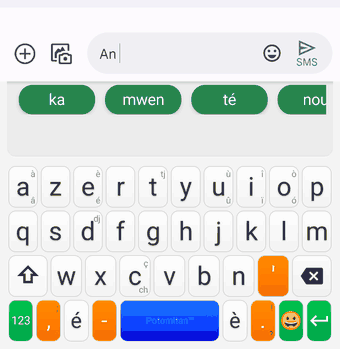
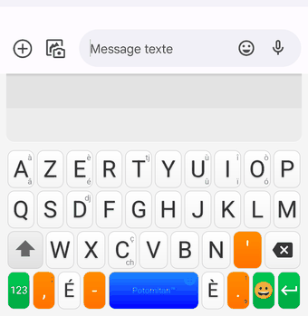
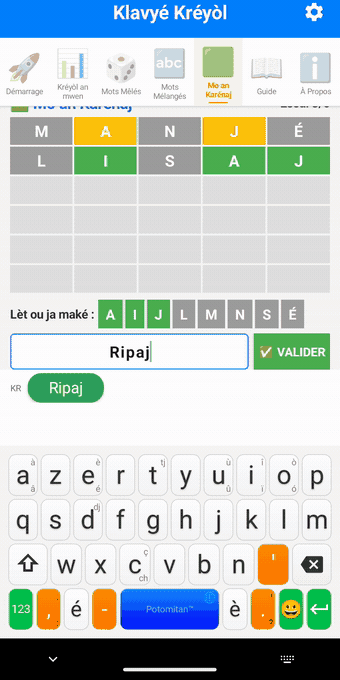

<!-- nav:start -->
<nav class="site">
  <a class="nav-brand" href="./" aria-current="page">⌨️ Klavyé Kréyòl</a>
  <a href="simulateur.html">🧪 Essayer</a>
  <a href="nouveautes.html">🎁 Nouveautés</a>
  

    
ℹ️ Le projet

    

      <a href="corpus.html">Le corpus en chiffres</a>
      <a href="presskit.html">Dossier de presse</a>
      <a href="partenaires.html">Partenariats institutionnels</a>
      <a href="notes_techniques.html">Notes techniques</a>
      <a href="https://github.com/famibelle/KreyolKeyb">Code source</a>
      <a href="privacy/privacy-policy.html">Confidentialité</a>
    

  

  <a href="faq.html">❓ FAQ</a>
  <a class="nav-cta" href="https://play.google.com/store/apps/details?id=com.potomitan.kreyolkeyboard&amp;referrer=utm_source%3Dlanding%26utm_campaign%3Dlaunch10k%26utm_content%3Dnav">📲 Installer, c'est gratuit</a>
  

    
Déjà installé ?

    

      <a href="guide.html">Guide d'installation</a>
      <a href="feedbacks_form.html">Donner son avis</a>
      <a href="beta_onboarding.html">Devenir bêta-testeur</a>
    

  

  

    
📣 Ambassadeurs

    

      <a href="ambassadeurs.html">Espace ambassadeurs</a>
      <a href="ambassade.html">Vin Anbasadè</a>
      <a href="charte-ambassadeur.html">Charte de l'ambassadeur</a>
      <a href="tract.html">Tract à imprimer</a>
      <a href="affiche.html">Affiche à imprimer</a>
      <a href="triptyque.html">Triptyque à imprimer</a>
      <a href="publicites.html">Visuels publicitaires</a>
      <a href="charte-graphique.html">Charte graphique</a>
    

  

  <button type="button" class="theme-toggle" aria-label="Changer de thème">🌙</button>
</nav>
<!-- Sur mobile, le bouton de la barre est masqué et remplacé par celle-ci,
     fixée en bas dans la zone du pouce, donc atteignable à toute profondeur
     de défilement. -->

  <a class="install-bar-cta" href="https://play.google.com/store/apps/details?id=com.potomitan.kreyolkeyboard&amp;referrer=utm_source%3Dlanding%26utm_campaign%3Dlaunch10k%26utm_content%3Dbarre-mobile">📲 Installer, c'est gratuit</a>
  <a class="install-bar-alt" href="simulateur.html">Essayer d'abord dans le navigateur</a>

<!-- nav:end -->

# Osez le Kréyòl

**Écrire en bon kréyòl, sans avoir à y penser.** Ce n'est pas vous qui
écriviez mal le kréyòl : c'est votre clavier qui ne le connaissait pas.

Klavyé Kréyòl Karukera est le **clavier créole guadeloupéen pour Android**
qui vous **propose les mots justes** pendant que vous tapez, puis ceux qui
viennent habituellement après, et qui **remet les accents** que vous
oubliez. Ses suggestions sortent des textes de Sylviane Telchid, Sonny
Rupaire, Max Rippon, Robert Fontes, Esnard Boisdur et bien d'autres.
Gratuit, open source, zéro pub, 100 % hors ligne.

## Ce qui vous retenait, et ce qui a changé

| | |
|---|---|
| 🤔 **« Mon téléphone corrige mon kréyòl en français »** | Il ne le fait plus. Ce clavier ne remplace jamais un mot par un autre : vos lettres restent exactement les vôtres. |
| 😬 **« Je ne suis pas sûr d'écrire les mots comme il faut »** | Le clavier vous les propose, tirés des textes de nos auteurs, et devine celui qui vient après. Vous n'inventez rien : vous choisissez. |
| 😤 **« Je ne sais jamais où mettre les accents »** | Tapez « kreyol » sans y penser : il devient « kréyòl » dès que vous validez le mot. Les accents oubliés reviennent tout seuls. |
| 🤷 **« De toute façon, personne ne l'écrit »** | Plus de 3 000 personnes l'ont déjà téléchargé. |

  <figure style="margin:0;max-width:340px;">
    
    <figcaption style="font-size:14px;color:var(--ink-soft);margin-top:6px;">Trois lettres suffisent : le mot juste est déjà proposé.</figcaption>
  </figure>
  <figure style="margin:0;max-width:340px;">
    
    <figcaption style="font-size:14px;color:var(--ink-soft);margin-top:6px;">Et si vous tapez tout, les accents se remettent seuls.</figcaption>
  </figure>

## Vérifiez tout de suite, sans rien installer

Tapez un mot dans ce clavier d'essai : les suggestions kréyòl et
françaises apparaissent comme sur votre téléphone, et vous retrouvez
l'exemple ci-dessus avec vos propres mots.

  <iframe src="simulateur.html?embed=1" width="380" height="620" style="border:0;max-width:100%;" loading="lazy" title="Simulateur Klavyé Kréyòl Karukera"></iframe>

## Ils en ont parlé

**[Guadeloupe la 1ère](https://la1ere.franceinfo.fr/guadeloupe/klavye-kreyol-karukera-l-appli-pour-smartphone-qui-facilite-la-redaction-de-messages-en-creole-guadeloupeen-1723969.html)**
(France Télévisions) lui a consacré un sujet au journal de 19h30 et un
article. **Canal 10** l'a présenté dans sa chronique Tech.
**[France-Antilles](https://www.guadeloupe.franceantilles.fr/actualite/economie/si-le-creole-guadeloupeen-nexiste-pas-petit-a-petit-on-sefface-1088477.php)**
en a fait un entretien : « Si le créole guadeloupéen n'existe pas, petit à
petit, on s'efface ». Les extraits sont dans le [dossier de
presse](presskit.html).

Et ceux qui l'utilisent, sur Google Play :

> ⭐⭐⭐⭐⭐ « Je passe ma note de 4 à 5 étoiles car depuis la maj, il y a les
> traductions des mots dans les jeux juste parfait ! »
>
> <small>Lionel TAURUS, 8 septembre 2026 · <a href="https://play.google.com/store/apps/details?id=com.potomitan.kreyolkeyboard&hl=fr">les 52 avis sur Google Play</a></small>

  

<em>Gratuit, sans publicité. L'installation prend deux
minutes, et le <a href="guide.html">guide</a> vous montre chaque écran.</em>

> 🔒 **Ce que vous tapez ne quitte pas votre téléphone.** Pas de compte, pas
> de serveur, aucune sauvegarde dans le nuage, pas même celle d'Android. Le
> code est public et vérifiable, et la [politique de
> confidentialité](privacy/privacy-policy.html) le dit en toutes lettres.

## Le clavier en action

**Une phrase entière, dans un vrai SMS.** Le mot « kréyòl » s'y écrit deux
fois : la première en touchant la suggestion, la seconde tapé sans accent,
que le clavier remet à l'espace. Comme « palé » et « maké » juste après.

  

## Ce que ça change pour vous

**Klavyé Kréyòl Karukera aide à deux niveaux : écrire le kréyòl au
quotidien, et le pratiquer davantage.**

### Pour écrire

| | |
|---|---|
| 💡 **Le mot juste vous est proposé, et le suivant aussi** | Les suggestions sortent d'un corpus littéraire créole, pas d'un dictionnaire générique. Le mot posé, le clavier propose ceux qui viennent habituellement après |
| ✍️ **Les accents ne se perdent plus** | Appui long pour les taper, et depuis peu, ils reviennent tout seuls si vous les oubliez : vos lettres ne changent jamais, seuls les accents s'ajoutent |
| 🇫🇷 **Un seul clavier pour le kréyòl et le français** | Le français prend le relais quand aucun mot créole ne correspond, pas besoin de changer de clavier |
| 🔢 **Il s'adapte à ce que vous écrivez** | Pavé de chiffres pour un numéro ou une date, arobase pour un e-mail : sans réglage à chercher |
| 🚫 **Zéro publicité, zéro tracker** | Le clavier reste concentré sur l'essentiel |
| 🆓 **Gratuit et open source** | Code public sur [GitHub](https://github.com/famibelle/KreyolKeyb), licence MIT |

### Pour pratiquer

**La gamification n'est pas un gadget : elle donne envie d'écrire encore
plus de kréyòl.** Chaque mot tapé peut devenir une carte à collectionner,
et chaque partie fait découvrir un mot qu'on n'aurait pas cherché
autrement.

| | |
|---|---|
| 📔 **Sanblé, le carnet des mots gagnés** | Chaque mot trouvé dans un jeu devient une carte, avec son sens en français et une phrase d'un auteur guadeloupéen |
| 🔁 **Sonjé, la révision qui vous relance au bon moment** | Si vous avez déjà réécrit le mot au clavier depuis, la carte avance toute seule : le clavier fait office d'examen |
| 🔡 **Six jeux, dont un jouable sans connaître un mot de créole** | Mo an plas donne les mots tout faits, à vous de les caser dans la grille |
| 🏆 **Une progression, de Pipirit à Potomitan** | Au fil des mots que vous tapez vraiment |

   
   
   

## Un projet de préservation linguistique

Le créole est parlé par **1,6 million de locuteurs en France**.

Ce n'est donc pas juste un clavier : **chaque message écrit en kréyòl aide
notre langue à exister** dans le numérique, là où elle se joue désormais
chaque jour. Le dictionnaire et les suggestions s'appuient sur les œuvres
d'écrivains, de linguistes et d'artistes qui ont donné au créole
guadeloupéen ses lettres de noblesse.

Il fait partie de l'écosystème **Potomitan™**, qui développe aussi
[POTOMITAN](https://potomitan.io), un traducteur français ↔ créole
guadeloupéen pensé pour les urgences et les démarches administratives
(soutenu par la Préfecture de Guadeloupe via Lab'An Nou, présenté par
Orange Antilles-Guyane).

## À découvrir en exclusivité 🎁

**Le clavier progresse chaque semaine.** Ce n'est pas une application
livrée puis abandonnée : les nouveautés arrivent en continu, parfois en
avance sur le Play Store.

  Chargement…
  <a href="nouveautes.html" class="btn" style="padding:10px 22px;white-space:nowrap;">🎁 Voir les nouveautés</a>

## Vin Anbasadè ! 📣

**Vous voulez aider le kréyòl à rayonner ?** Notre page ambassadeurs vous
donne tout : les contacts des médias locaux, les emails pré-remplis en un
clic, quoi dire si vous appelez une radio, et un tract à imprimer pour
le laisser chez le boulanger, le pharmacien ou la boutique du coin.

  <a href="ambassade.html" class="btn" style="padding:12px 28px;">🤝 Devenir ambassadeur du Klavyé Kréyòl</a>
  <a href="tract.html" class="btn" style="padding:12px 28px;">🖨️ Imprimer le tract</a>

**Pou laprès :** [dossier de presse / press kit](presskit.html)

## Contacts

Les questions les plus posées, « est-ce que ça remplace mon clavier ? »,
« mes messages partent-ils quelque part ? », ont leur réponse sur la page
**[questions fréquentes](faq.html)**.

Pour le reste, une proposition, un partenariat ? Écrivez à
**[contact@potomitan.io](mailto:contact@potomitan.io)**.

Le code source est ouvert et public sur
[GitHub](https://github.com/famibelle/KreyolKeyb).

---

An kréyòl nou ka palé, an kréyòl nou ka maké.

C'est ce que vous rejoignez en l'installant.

<!-- footer:start -->
<footer class="site">
  

    
An kréyòl nou ka palé, an kréyòl nou ka maké.

    <a class="btn primary" href="https://play.google.com/store/apps/details?id=com.potomitan.kreyolkeyboard&amp;referrer=utm_source%3Dlanding%26utm_campaign%3Dlaunch10k%26utm_content%3Dpied">📲 Installer, c'est gratuit</a>
  

  

    

      <strong>Le clavier</strong>
      <a href="./" aria-current="page">Accueil</a>
      <a href="simulateur.html">Essayer en ligne</a>
      <a href="guide.html">Guide d'installation</a>
      <a href="faq.html">Questions fréquentes</a>
      <a href="nouveautes.html">Nouveautés</a>
    

    

      <strong>Le projet</strong>
      <a href="corpus.html">Le corpus en chiffres</a>
      <a href="presskit.html">Dossier de presse</a>
      <a href="partenaires.html">Partenariats institutionnels</a>
      <a href="notes_techniques.html">Notes techniques</a>
      <a href="ergotherapie.html">Fiche ergothérapie</a>
      <a href="comparatif.html">Comparatif des claviers</a>
      <a href="comparatif-gboard.html">Mesures face à Gboard</a>
      <a href="https://github.com/famibelle/KreyolKeyb">Code source</a>
    

    

      <strong>Faire connaître</strong>
      <a href="ambassadeurs.html">Espace ambassadeurs</a>
      <a href="ambassade.html">Vin Anbasadè</a>
      <a href="charte-ambassadeur.html">Charte de l'ambassadeur</a>
      <a href="tract.html">Tract</a>
      <a href="affiche.html">Affiche</a>
      <a href="triptyque.html">Triptyque</a>
      <a href="publicites.html">Visuels publicitaires</a>
      <a href="charte-graphique.html">Charte graphique</a>
    

    

      <strong>Participer</strong>
      <a href="beta_onboarding.html">Devenir bêta-testeur</a>
      <a href="feedbacks_form.html">Donner son avis</a>
      <a href="jauge.html">La jauge des 10 000</a>
      <a href="mailto:contact@potomitan.io">contact@potomitan.io</a>
    

  

  

    Potomitan™, Teknoloji pou tout moun.
    <a href="privacy/privacy-policy.html">Politique de confidentialité</a>
    Gratuit, open source (MIT), zéro pub, 100&nbsp;% hors ligne.
  

</footer>
<!-- footer:end -->
