<!-- nav:start -->
<nav class="site">
  <a class="nav-brand" href="./">⌨️ Klavyé Kréyòl</a>
  <a href="simulateur.html">🧪 Essayer</a>
  <a href="nouveautes.html">🎁 Nouveautés</a>
  

    
ℹ️ Le projet

    

      <a href="corpus.html">Le corpus en chiffres</a>
      <a href="presskit.html" aria-current="page">Dossier de presse</a>
      <a href="partenaires.html">Partenariats institutionnels</a>
      <a href="notes_techniques.html">Notes techniques</a>
      <a href="https://github.com/famibelle/KreyolKeyb">Code source</a>
      <a href="privacy/privacy-policy.html">Confidentialité</a>
    

  

  <a href="faq.html">❓ FAQ</a>
  <a class="nav-cta" href="https://play.google.com/store/apps/details?id=com.potomitan.kreyolkeyboard&amp;referrer=utm_source%3Dlanding%26utm_campaign%3Dlaunch10k%26utm_content%3Dnav">📲 Installer, c'est gratuit</a>
  

    
Déjà installé ?

    

      <a href="guide.html">Guide d'installation</a>
      <a href="feedbacks_form.html">Donner son avis</a>
      <a href="beta_onboarding.html">Devenir bêta-testeur</a>
    

  

  

    
📣 Ambassadeurs

    

      <a href="ambassadeurs.html">Espace ambassadeurs</a>
      <a href="ambassade.html">Vin Anbasadè</a>
      <a href="charte-ambassadeur.html">Charte de l'ambassadeur</a>
      <a href="tract.html">Tract à imprimer</a>
      <a href="affiche.html">Affiche à imprimer</a>
      <a href="triptyque.html">Triptyque à imprimer</a>
      <a href="publicites.html">Visuels publicitaires</a>
      <a href="charte-graphique.html">Charte graphique</a>
    

  

  <button type="button" class="theme-toggle" aria-label="Changer de thème">🌙</button>
</nav>
<!-- Sur mobile, le bouton de la barre est masqué et remplacé par celle-ci,
     fixée en bas dans la zone du pouce, donc atteignable à toute profondeur
     de défilement. -->

  <a class="install-bar-cta" href="https://play.google.com/store/apps/details?id=com.potomitan.kreyolkeyboard&amp;referrer=utm_source%3Dlanding%26utm_campaign%3Dlaunch10k%26utm_content%3Dbarre-mobile">📲 Installer, c'est gratuit</a>
  <a class="install-bar-alt" href="simulateur.html">Essayer d'abord dans le navigateur</a>

<!-- nav:end -->

# Dossier de presse : Klavyé Kréyòl Karukera

*Dernière mise à jour : 19 septembre 2026*

## En une phrase

**Klavyé Kréyòl Karukera est un clavier mobile intelligent dédié au créole
guadeloupéen** : il suggère les mots en kréyòl pendant la frappe, à
partir d'un corpus littéraire créole authentique. Gratuit, open source, et
sans aucune collecte de données.

L'ambition du projet va au-delà d'Android : que le kréyòl s'écrive bien sur
tous les claviers, y compris celui de l'iPhone. Aujourd'hui, seule la version
Android est publiée ; la version iOS est en préparation.

## L'éditeur

Klavyé Kréyòl Karukera est édité par **Potomitan™**, société par actions
simplifiée.

Potomitan™ développe également [POTOMITAN](https://potomitan.io), un
traducteur d'urgence français et créole soutenu par la Préfecture de
Guadeloupe dans le cadre du Lab'An Nou et présenté par Orange
Antilles-Guyane, déjà couvert par France-Antilles sous le titre « POTOMITAN,
l'IA qui parle créole ». Écrire le kréyòl avec le clavier, le traduire avec
POTOMITAN : deux réponses complémentaires au même vide numérique, portées par
la même structure.

Collectivités, services de l'État, établissements et opérateurs publics : les
formes de collaboration possibles sont décrites sur la page
[Partenariats institutionnels](partenaires.html).

## Ils en parlent déjà

Fin juillet 2026, deux chaînes de télévision guadeloupéennes ont consacré un
sujet au clavier :

  

    <video controls preload="metadata" poster="Medias/TV_Canal10_poster.jpg" style="width: 100%; border-radius: 8px;">
      <source src="Medias/TV_Canal10.mp4" type="video/mp4">
      Votre navigateur ne supporte pas la lecture vidéo intégrée.
      <a href="Medias/TV_Canal10.mp4">Télécharger l'extrait Canal 10</a>.
    </video>
    
<strong>Canal 10</strong> — sujet Tech « Une application intuitive
    pour écrire en créole » : présentation et démonstration du clavier à
    l'antenne.

  

  

    <video controls preload="metadata" poster="Medias/TV_Guadeloupe1ère_poster.jpg" style="width: 100%; border-radius: 8px;">
      <source src="Medias/TV_Guadeloupe1ère.mp4" type="video/mp4">
      Votre navigateur ne supporte pas la lecture vidéo intégrée.
      <a href="Medias/TV_Guadeloupe1ère.mp4">Télécharger l'extrait Guadeloupe la 1ère</a>.
    </video>
    
<strong>Guadeloupe la 1ère</strong> (France Télévisions) — journal
    <em>Guadeloupe Soir 19h30</em> du mardi 28 juillet 2026, sujet « Karukéra
    : on jan pou maké kréyòl-la », avec le témoignage d'un utilisateur du
    clavier.
    <a href="https://la1ere.franceinfo.fr/guadeloupe/programme-video/la1ere_guadeloupe_guadeloupe-soir-19h30/diffusion/8682591-emission-du-mardi-28-juillet-2026.html">Replay complet sur la1ere.franceinfo.fr</a>.

  

Guadeloupe la 1ère a également publié un article dédié : [« Klavyé Kréyòl
Karukera, l'appli. pour smartphone qui facilite la rédaction de messages en
créole guadeloupéen »](https://la1ere.franceinfo.fr/guadeloupe/klavye-kreyol-karukera-l-appli-pour-smartphone-qui-facilite-la-redaction-de-messages-en-creole-guadeloupeen-1723969.html)
(Nadine Fadel, Rudy Rilcy · la1ere.franceinfo.fr, 30/07/2026).

Le 4 août 2026, France-Antilles Guadeloupe a publié [« Si le créole
guadeloupéen n'existe pas, petit à petit, on s'efface »](https://www.guadeloupe.franceantilles.fr/actualite/economie/si-le-creole-guadeloupeen-nexiste-pas-petit-a-petit-on-sefface-1088477.php)
(Stéphanie Vélin · guadeloupe.franceantilles.fr), qui retrace la genèse du
projet à travers un entretien avec Medhi Famibelle : « Tout est parti d'une
frustration personnelle », y explique-t-il, décrivant comment ses propres
messages en créole étaient systématiquement corrigés en français par les
claviers standards.

### Revue de presse

| Média | Date | Format | Sujet |
|---|---|---|---|
| Canal 10 | juillet 2026 | Télévision, sujet Tech | « Une application intuitive pour écrire en créole » |
| Guadeloupe la 1ère (France Télévisions) | 28/07/2026 | Télévision, *Guadeloupe Soir 19h30* | [« Karukéra : on jan pou maké kréyòl-la »](https://la1ere.franceinfo.fr/guadeloupe/programme-video/la1ere_guadeloupe_guadeloupe-soir-19h30/diffusion/8682591-emission-du-mardi-28-juillet-2026.html) |
| la1ere.franceinfo.fr | 30/07/2026 | Article web | [« Klavyé Kréyòl Karukera, l'appli. pour smartphone qui facilite la rédaction de messages en créole guadeloupéen »](https://la1ere.franceinfo.fr/guadeloupe/klavye-kreyol-karukera-l-appli-pour-smartphone-qui-facilite-la-redaction-de-messages-en-creole-guadeloupeen-1723969.html) |
| France-Antilles Guadeloupe | 04/08/2026 | Presse écrite, entretien | [« Si le créole guadeloupéen n'existe pas, petit à petit, on s'efface »](https://www.guadeloupe.franceantilles.fr/actualite/economie/si-le-creole-guadeloupeen-nexiste-pas-petit-a-petit-on-sefface-1088477.php) |

## Angles possibles

- **Souveraineté et préservation numériques** : en Guadeloupe, un
  développeur vient de lancer Klavyé Kréyòl Karukera, un clavier pour
  smartphone qui permet d'écrire facilement le créole guadeloupéen en
  respectant son orthographe. Au-delà de l'aspect pratique, le sujet
  raconte quelque chose de plus profond : à l'heure où l'IA apprend à
  partir de ce qui existe en ligne, une langue qui n'est pas présente dans
  les usages numériques risque peu à peu de devenir invisible pour les
  modèles. Ce clavier est aussi un outil de souveraineté numérique et de
  préservation linguistique : il favorise la production de contenus en
  créole, qui pourront demain nourrir les corpus, les moteurs de recherche
  et les intelligences artificielles. C'est une histoire qui pose une
  question assez universelle : comment les langues minoritaires peuvent-elles
  continuer d'exister à l'ère de l'IA ?
- **Patrimoine × tech** : quand l'intelligence des claviers se met au service
  d'une langue régionale
- **Les rendez-vous de la langue créole** : festivals, semaines culturelles
  et événements scolaires de l'automne trouvent ici un outil concret, qui sert
  ensuite toute l'année
- **Éducation** : un outil d'écriture pour les professeurs de créole (LVR,
  CAPES créole) et leurs élèves, dans une discipline où l'écrit est évalué
  (voir *Un usage en classe de langue vivante régionale*, plus bas)
- **Numérique public et égalité d'accès** : gratuit, fonctionnant sur des
  appareils anciens, sans connexion et sans compte, l'outil n'écarte aucune
  famille pour des raisons d'équipement ou de forfait. Une
  [fiche d'usage en ergothérapie](ergotherapie.html) documente par ailleurs
  son intérêt pour les personnes ayant des difficultés motrices de saisie
- **Apprendre en jouant** : chaque mot trouvé dans l'un des six jeux devient
  une carte à collectionner, avec son sens en français et une phrase
  d'auteur guadeloupéen, puis revient en révision à intervalles réguliers
  (voir *Apprendre en jouant*, plus bas)
- **Le créole entre dans le clavier de l'iPhone** : avec iOS 27, Apple ajoute
  le créole guadeloupéen et le créole martiniquais à ses claviers
  (« Kréyòl Gwadloup »), sans correction automatique ni saisie prédictive.
  L'occasion de comparer ce que fait un clavier généraliste et ce que fait un
  clavier dédié à la langue (voir *Face aux autres claviers*, plus haut)
- **Open source citoyen** : un projet indépendant, auditable, sans modèle
  publicitaire
- **Les racines du kréyòl** : en février 2026, des chercheurs créolistes
  (dont Tony Mango sur Radyo Tanbou) annoncent explorer les origines
  africaines réelles de la langue mère du côté des langues congolaises, un
  écho direct au corpus littéraire créole sur lequel s'appuie le clavier
- **Un écosystème, pas un produit isolé** : le clavier et le traducteur
  POTOMITAN répondent au même vide numérique, l'un pour écrire le kréyòl,
  l'autre pour le traduire (voir *L'éditeur*, plus haut)

## Le contexte, en chiffres

Le créole est parlé par **1,6 million de locuteurs en France**. Dans les
chiffres de l'Éducation nationale, les effectifs en créole **au primaire ont
augmenté de 92 % entre 2021 et 2023** (4 643 à 8 896 écoliers), pendant que
ceux du lycée reculaient de 43,7 % sur la même période.

Klavyé Kréyòl Karukera se situe sur un autre terrain, celui de l'usage
quotidien : un projet citoyen, gratuit et open source, qui équipe la langue
pour le numérique, là où elle s'écrit désormais chaque jour, dans les SMS et
les réseaux sociaux de centaines de milliers de créolophones.

## Le problème

Les claviers généralistes ont longtemps ignoré le créole guadeloupéen.
Gboard en propose une disposition depuis novembre 2018, avec des
suggestions de mots, et Apple l'ajoute avec iOS 27 en septembre 2026, sans
correction automatique ni saisie prédictive d'après sa page officielle. Dans
notre essai sur douze phrases tapées sans accent, Gboard a remplacé huit mots
par d'autres mots (voir le comparatif, avec ses limites). Le créole recule dans les usages numériques
quotidiens, SMS, WhatsApp, réseaux sociaux, et l'aide à la frappe reste à
construire.

## La réponse

Un clavier qui **travaille pour le kréyòl au lieu de le combattre** :

- **Suggestions intelligentes** à partir d'un dictionnaire de plus de
  **5 200 mots** kréyòl et d'un modèle de prédiction contextuelle (n-grams,
  4 600 mots-pivots) construit sur des textes littéraires créoles
  authentiques
- **Accents du kréyòl** (é, è, à, ò...) par simple appui long
- **Bilingue** : le français prend le relais quand aucun mot créole ne correspond
- **Six jeux de vocabulaire** intégrés et un **carnet de cartes à
  collectionner** (voir *Apprendre en jouant*, plus bas), plus une
  **progression gamifiée** en 7 niveaux culturels, de « Pipirit » à « Potomitan »
- **100 % local, zéro collecte de données**, code source public (licence MIT)

## Face aux autres claviers

Trois voies existent aujourd'hui pour écrire en créole guadeloupéen sur un
téléphone. Le tableau ne retient que ce que nous avons pu constater ; une case
« non vérifié » signale ce que nous n'avons pas pu contrôler, pas une absence.

| | Klavyé Kréyòl | Gboard | Clavier Apple |
|---|---|---|---|
| Langue proposée | Oui, sa seule raison d'être | Oui, depuis novembre 2018 (Android) | Oui, depuis iOS 27 (septembre 2026) |
| Suggestions en créole | Oui | Oui (constaté le 19 septembre 2026) | Non, selon la page officielle d'Apple |
| Prédiction du mot suivant | Oui | Oui (constaté le 19 septembre 2026) | Non, selon la page officielle d'Apple |
| Correction automatique | Les accents seulement (depuis la 22.1.0), jamais un mot pour un autre | Oui : accents rétablis, et des mots remplacés | Non, selon la page officielle d'Apple |
| Créole et français ensemble | Oui, sans réglage | Plusieurs langues, à activer | Non pour cette langue |
| Dictionnaire consultable | Oui, dans le dépôt public, et dans l'application (1 145 mots traduits, recherche dans les deux sens) | Non | Non |
| Accès à Internet | Aucune permission | Permission déclarée | Frappe embarquée |
| Nom donné à la langue par le clavier | « Kréyòl Gwadloup » | « Kwéyòl », le nom saint-lucien, sur la barre d'espace (relevé le 20 septembre 2026) | « Kréyòl Gwadloup », selon la presse locale |
| Dictée vocale en créole guadeloupéen | Non, pas de dictée | **Non.** Gboard dicte, mais Google ne donne pas cette langue parmi celles que la saisie vocale couvre | Non, absente de la liste « Dictation » d'Apple |
| Jeux de vocabulaire | Oui, six jeux, un carnet de cartes et une révision espacée | Non | Non |
| Progression personnelle | Oui, sept niveaux et le compte des mots découverts | Non | Non |
| Prix | Gratuit, sans publicité | Gratuit | Inclus dans le système |

Gboard couvre une surface fonctionnelle plus large : saisie glissée,
presse-papiers, traduction, et une dictée vocale qui ne couvre pas le créole
guadeloupéen. Aucun des trois claviers ne permet de dicter dans cette langue.
Le clavier d'Apple, lui, s'intègre au système sans rien à installer. À l'inverse, ni l'un ni l'autre ne porte de dictionnaire
consultable, de jeux ni de progression : ce sont des claviers, là où Klavyé
Kréyòl est aussi un outil de vocabulaire. Le détail, les sources et les limites de chaque case sont
dans le [comparatif détaillé](comparatif_d%C3%A9taill%C3%A9s.html).

## Un usage en classe de langue vivante régionale

Le créole est enseigné en langue vivante régionale de l'école au lycée, et
l'écrit y occupe une place centrale. C'est exactement là que les claviers du
marché travaillent contre l'élève, en corrigeant sa langue vers le français.

Ce que le clavier apporte dans ce cadre, aujourd'hui :

- La suggestion des mots kréyòl **avec leurs accents**, sur un dictionnaire
  construit à partir de textes créoles
- Six jeux de vocabulaire, un carnet de cartes avec révision espacée et un
  parcours de progression en niveaux, utilisables comme support d'activité
- Gratuit, sans compte, sans connexion, sur des appareils Android anciens :
  aucune famille n'en est écartée pour des raisons d'équipement, de forfait ou
  de moyens
- Une [fiche d'usage en ergothérapie](ergotherapie.html) pour les élèves ayant
  des difficultés motrices de saisie
- Aucun traitement de données à déclarer : ni compte, ni serveur, ni
  télémétrie, ce qui simplifie considérablement l'introduction de l'outil dans
  un établissement

**Une précision qui a son importance :** l'application est d'abord un outil
d'écriture, qui sert l'enseignement de l'écrit. Les jeux et le carnet de
cartes permettent de découvrir et de retenir du vocabulaire en jouant, sans
prétendre remplacer un cours de créole.

Les formes de collaboration possibles avec les académies, les établissements
et les collectivités sont décrites sur la page
[Partenariats institutionnels](partenaires.html#lvr).

## Apprendre en jouant : six jeux et un carnet de cartes

L'onglet *Jé* de l'application réunit six jeux autour des mots du
dictionnaire kréyòl du clavier :

| Jeu | Principe |
|---|---|
| Mots Mêlés | Retrouver les mots cachés dans une grille de lettres |
| Mots Mélangés | Remettre les lettres d'un mot dans l'ordre |
| Mo an Karénaj | Deviner un mot de cinq lettres en six essais |
| Fraz a twou | Compléter une phrase d'auteur à laquelle il manque un mot |
| Mokwaré | Mots croisés : écrire les mots d'après leur sens en français |
| Mo an plas | Placer dans une grille vide des mots donnés, d'après leur longueur et leurs croisements |

*Mo an plas*, ajouté en septembre 2026, est le seul des six qui se joue sans
connaître un mot de kréyòl : les mots sont fournis, il reste à trouver leur
place. Le sens en français de chaque mot apparaît une fois le mot et ses
croisements en place.

**Le carnet *Sanblé*.** Chaque mot gagné dans un jeu devient une carte à
collectionner. La carte porte le mot, son sens en français avec la source de
la définition (Kreyolopedia ou Wiktionnaire, sous licence CC BY-SA), et, pour
479 mots, une phrase extraite d'un texte d'auteur du corpus, avec son
crédit. Sa rareté est calculée d'après la fréquence réelle du mot dans ce
corpus. Seuls les mots dont le sens est connu deviennent des cartes, soit
622 mots à collectionner.

**La révision *Sonjé*.** Les cartes reviennent à intervalles croissants
(1 jour, 3 jours, 1 semaine, 2 semaines, 1 mois, 3 mois) selon la méthode de
la répétition espacée, jusqu'à être considérées comme acquises. Un mot que
l'on a tapé avec le clavier depuis la dernière révision avance de lui-même
d'une case : le clavier fait office d'examen.

Les cartes sont rangées dans une boîte en bois à six casiers, un par
intervalle. Toucher un casier déploie ses cartes en éventail, qu'on fait
défiler du doigt ; toucher « Réviser » lance la séance : chaque carte montre
son mot, se retourne pour donner son sens et sa phrase d'auteur, et se range
selon la réponse (« Je savais » ou « Pas su »).

  

    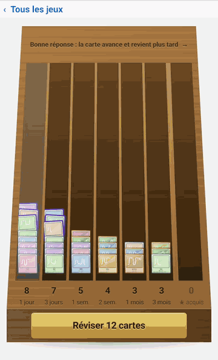
    
<small>Un casier de la boîte : les cartes en éventail</small>

  

  

    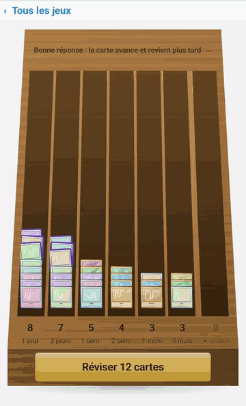
    
<small>La révision Sonjé, carte après carte</small>

  

*Sanblé* (rassembler) et *Sonjé* (se souvenir) sont tirés du dictionnaire
embarqué. Comme le reste de l'application, les jeux et le carnet
fonctionnent hors connexion et sans compte : la collection reste sur le
téléphone.

## Ce que l'application contient, et ce qu'elle ne contient pas

Ces éléments sont vérifiables dans le
[dépôt public](https://github.com/famibelle/KreyolKeyb) et détaillés dans les
[notes techniques](notes_techniques.html).

- **Aucun texte d'auteur n'est embarqué.** L'application ne transporte que des
  statistiques : une liste de couples mot et fréquence, et pour chaque clé la
  liste des mots suivants observés avec leur probabilité. La plus longue
  séquence de mots reconstructible depuis ces données est de **trois mots**
- **Chaque entrée du corpus source porte sa source**, ce qui rend la
  provenance traçable entrée par entrée. Le corpus rassemble 87 sources
  distinctes, dont la majorité est produite dans le cadre du projet
- **Aucune donnée ne quitte l'appareil.** Pas de compte, pas de serveur, pas
  de statistique d'usage remontée, y compris de manière anonyme. Le clavier
  fonctionne sans connexion
- **Aucune publicité, aucun achat intégré, aucune marque.** L'application ne
  fait la promotion de personne, y compris d'un éventuel partenaire ou
  financeur
- **Le code est public sous licence MIT** et auditable, y compris les
  développements financés dans le cadre d'un partenariat

## Le corpus : un hommage aux défenseurs du kréyòl

Les suggestions s'appuient sur les œuvres de :

- ✍️ **Écrivains et poètes** : Sylviane Telchid, Sonny Rupaire, Max Rippon, Gisèle Pineau, Katel
- 📚 **Linguistes et chercheurs** : Robert Fontes, Alain Rutil, Alain Vérin, Benjamin Moïse
- 🎤 **Artistes et conteurs** : Esnard Boisdur, Jomimi, Pierre Édouard Décimus

## Faits clés

| | |
|---|---|
| Plateforme | Android 5.0+ aujourd'hui. L'ambition est de couvrir tous les claviers, iPhone compris : la version iOS est en préparation |
| Prix | Gratuit, sans pub, sans achat intégré |
| Données personnelles | Aucune collecte, fonctionnement 100 % hors ligne |
| Licence | Open source (MIT), code sur [GitHub](https://github.com/famibelle/KreyolKeyb) |
| Éditeur | [Potomitan™](https://potomitan.io), société par actions simplifiée |
| Écosystème | Développe aussi [POTOMITAN](https://potomitan.io), traducteur d'urgence français ↔ créole |
| Téléchargement | [Google Play](https://play.google.com/store/apps/details?id=com.potomitan.kreyolkeyboard&referrer=utm_source%3Dpresse%26utm_campaign%3Dlaunch10k) |
| Couverture presse | Canal 10, Guadeloupe la 1ère (TV, juillet 2026), France-Antilles Guadeloupe (04/08/2026) |
| Corpus source | 87 sources distinctes, provenance tracée entrée par entrée ([le corpus en chiffres](corpus.html)) |
| Données embarquées | Fréquences et probabilités de succession, aucun texte d'auteur |
| Dictionnaire | Plus de 5 200 mots kréyòl, plus un appoint français qui couvre le vocabulaire courant : les deux langues sont proposées ensemble, sans réglage |
| Modèle de prédiction | Plus de 4 600 mots-pivots (n-grams contextuels) |
| Comparatif | [Quel clavier pour écrire en kréyòl ?](comparatif.html), en étoiles, et le [détail ligne par ligne](comparatif_d%C3%A9taill%C3%A9s.html) avec ses sources |
| Jeux | 6 jeux de vocabulaire, un carnet de 622 cartes à collectionner, révision espacée |
| Utilisateurs | 3 356 installations au 19 septembre 2026 (chiffre exact de la Play Console, [progression publique](jauge.html)) |
| Usage scolaire | Langue vivante régionale, de l'école au lycée ([détail](partenaires.html#lvr)) |
| Partenariats | [Partenariats institutionnels](partenaires.html) |

## Visuels

### Les jeux et le carnet de cartes (septembre 2026)

  

    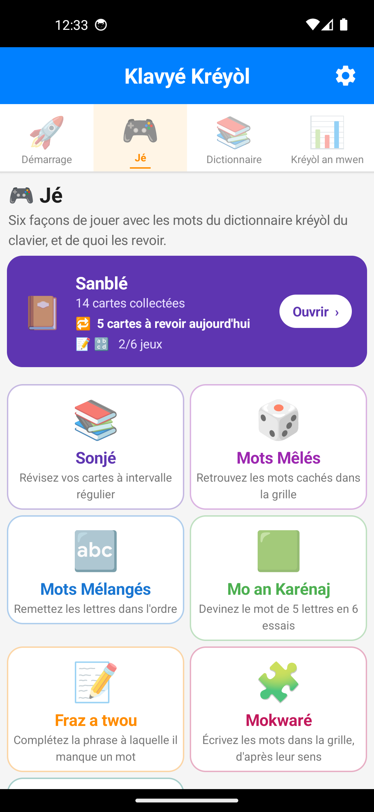
    
<small>Les six jeux et le carnet</small>

  

  

    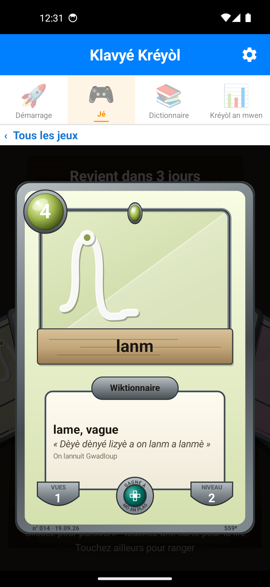
    
<small>Une carte : le mot lanm</small>

  

  

    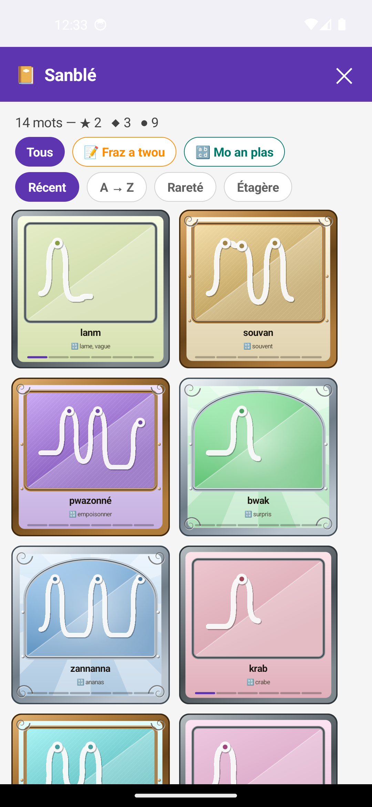
    
<small>Le carnet Sanblé</small>

  

  

    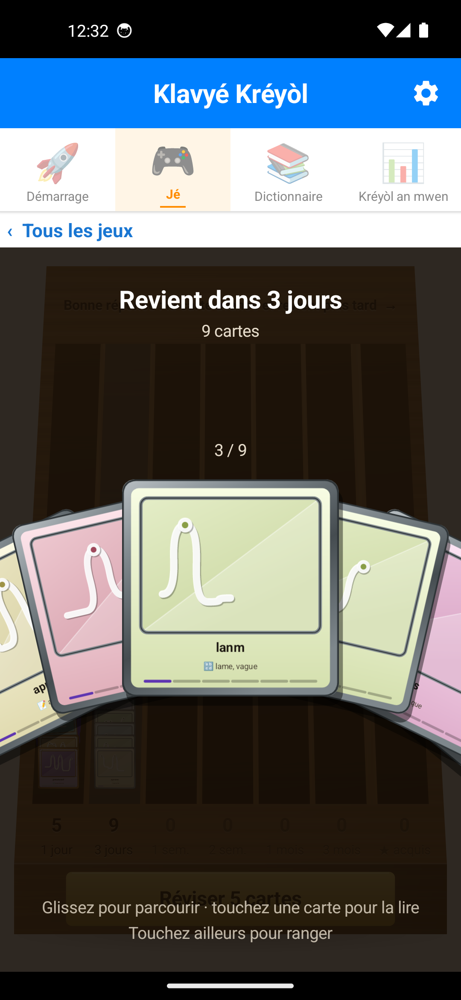
    
<small>Les cartes à revoir</small>

  

  

    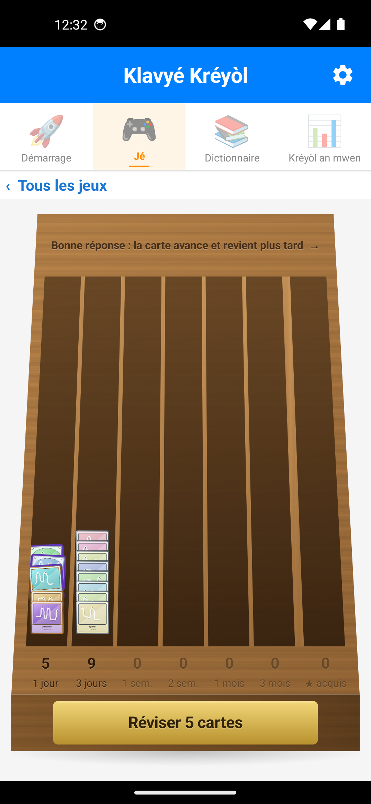
    
<small>La révision Sonjé</small>

  

  

    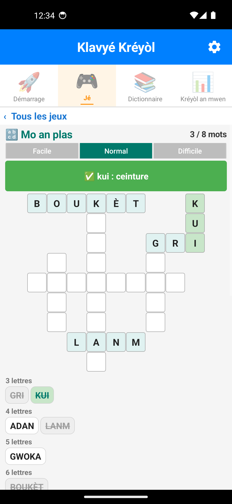
    
<small>Jeu Mo an plas</small>

  

  

    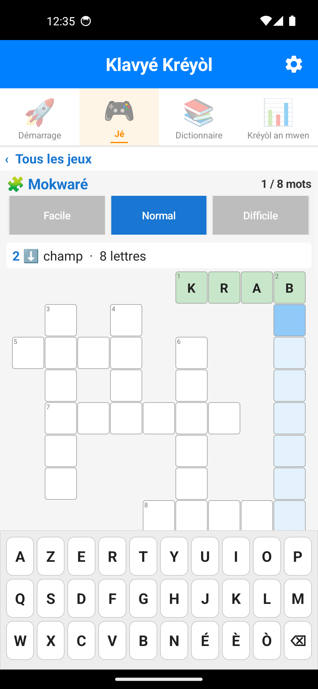
    
<small>Jeu Mokwaré</small>

  

### Le clavier et l'application

Deux phrases écrites de bout en bout dans une conversation SMS. La première, « An kay òwganizé on diné » : le `ò` par appui long sur la touche `o`, la suggestion `òwganizé` touchée dans la barre, les touches `é` et `è` de la rangée du bas, puis l'envoi. La seconde, « An kréyòl nou ka palé, an kréyòl nou ka maké », l'accroche du projet : les suggestions touchées pour *kréyòl*, *nou*, *ka* et *maké*, puis l'envoi. Animations de 14 et 19 secondes, réalisées sur l'application 22.0.2 (septembre 2026), numéros de destinataire fictifs.

  

    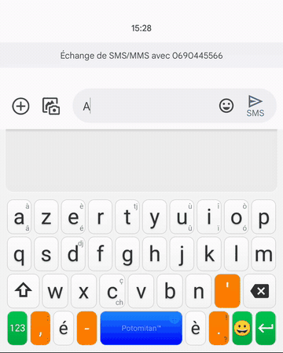
    
<small>Une phrase avec ses accents, envoyée par SMS</small>

  

  

    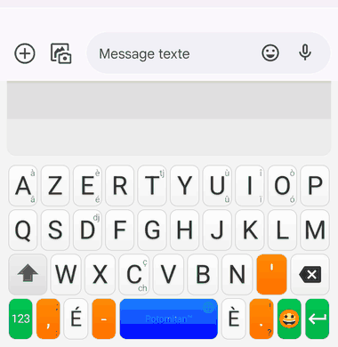
    
<small>L'accroche du projet, tapée sans accent : le clavier les rétablit tout seul</small>

  

Captures d'écran de chaque section de l'application, version 22.0.2 (septembre 2026) :

  

    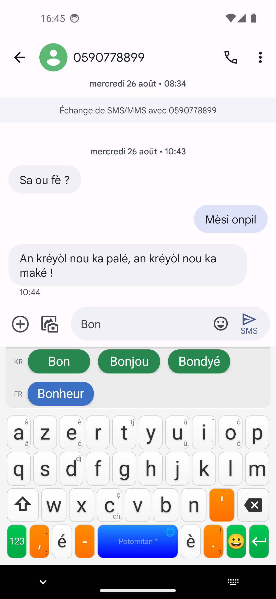
    
<small>Suggestions en conditions réelles</small>

  

  

    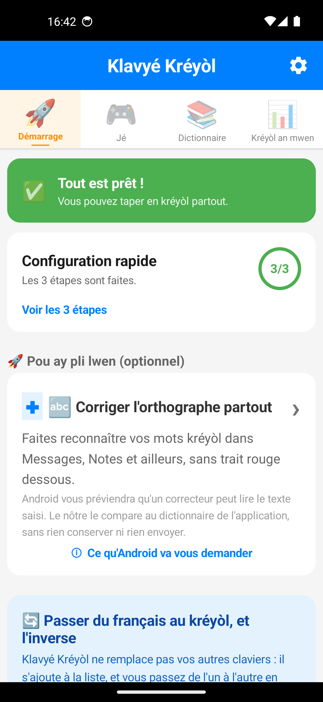
    
<small>Accueil / configuration</small>

  

  

    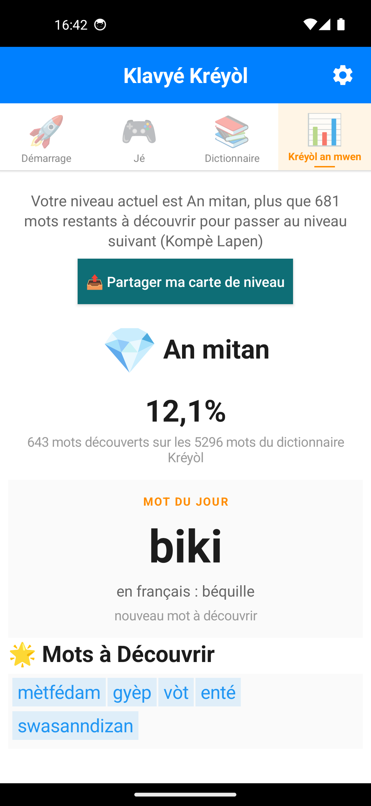
    
<small>Progression gamifiée</small>

  

  

    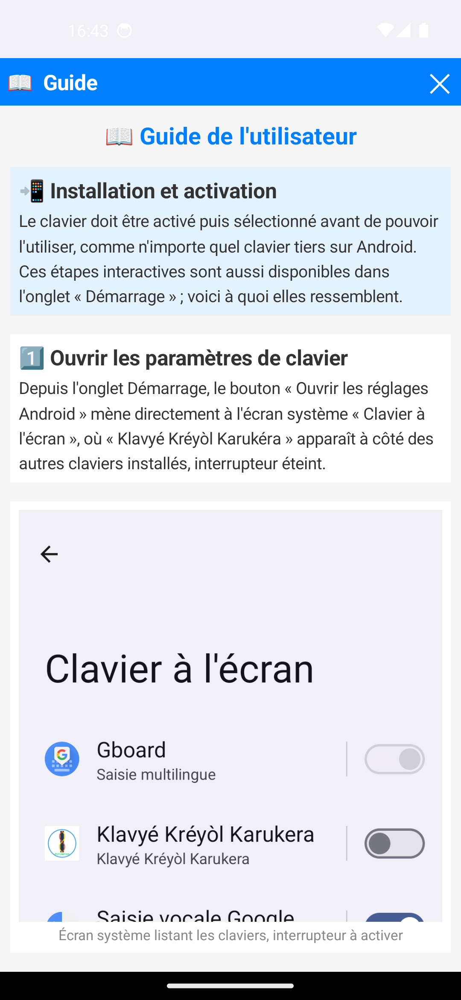
    
<small>Guide d'utilisation</small>

  

  

    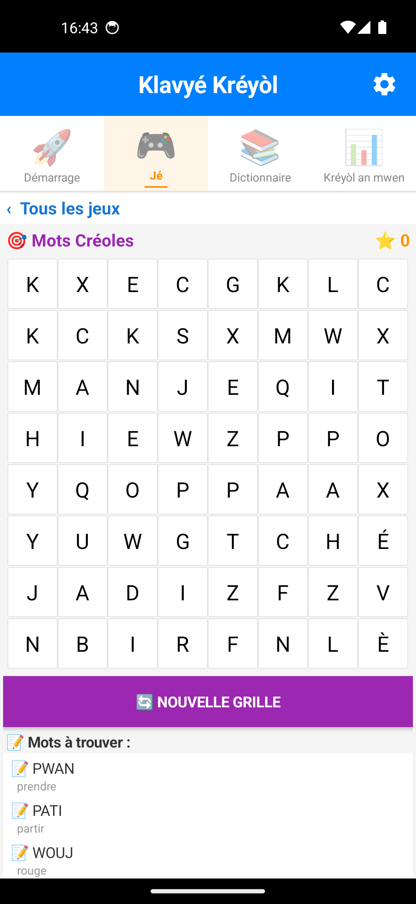
    
<small>Jeu Mots Mêlés</small>

  

  

    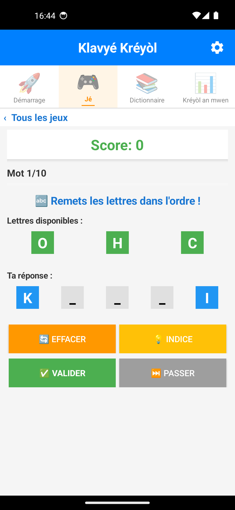
    
<small>Jeu Mots Mélangés</small>

  

  

    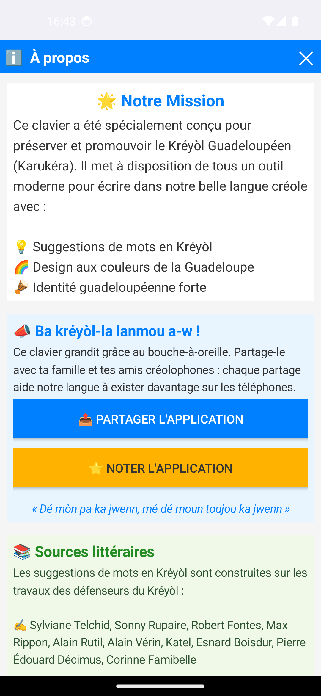
    
<small>À propos / mission</small>

  

  

    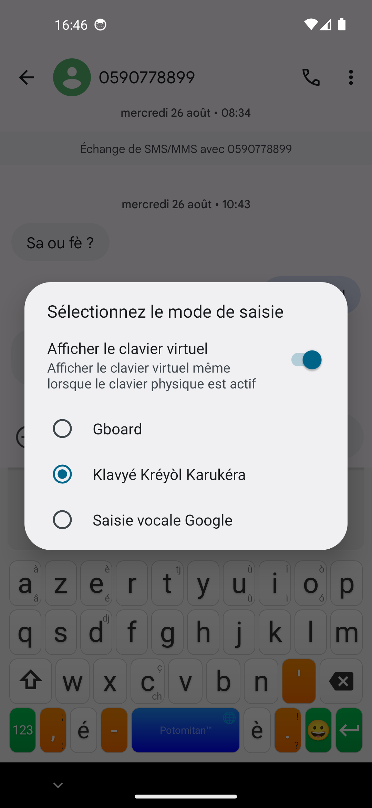
    
<small>Sélecteur de clavier système</small>

  

  

    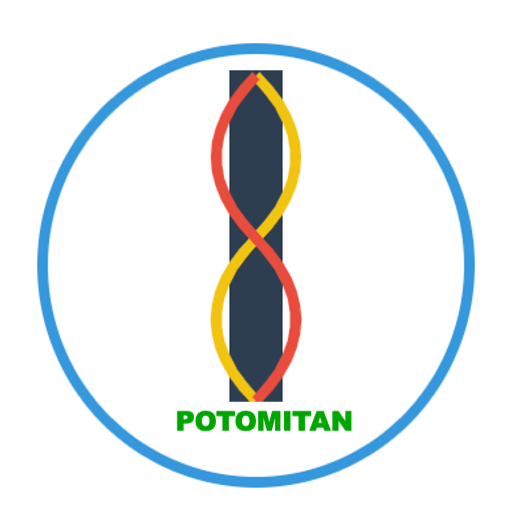
    
<small>Logo Potomitan™</small>

  

**[Télécharger le kit presse (ZIP, 5,8 Mo)](presse/kit-presse.zip)** :
les quinze captures ci-dessus en pleine résolution, les quatre animations et
le logo, avec leurs conditions d'utilisation.

- [Animation : une phrase kréyòl écrite et envoyée par SMS](Screenshots/gif_ownganize_sms.gif)
- [Animation : les cartes d'un casier en éventail](Screenshots/gif_eventail_cartes.gif) et [la révision Sonjé](Screenshots/gif_boite_leitner.gif)
- [Animation du clavier en action : l'accroche « An kréyòl nou ka palé, an kréyòl nou ka maké »](Screenshots/KlavyéAnAktion.gif)
- [Toutes les captures d'écran](https://github.com/famibelle/KreyolKeyb/tree/main/docs/Screenshots) (suggestions, accents, jeux, carnet de cartes, gamification)
- [Reportage Canal 10](Medias/TV_Canal10.mp4) et [reportage Guadeloupe la 1ère](Medias/TV_Guadeloupe1ère.mp4) (extraits vidéo, voir aussi ci-dessus)
- [Logo Potomitan™ en haute résolution](assets/potomitan-logo.png)

## Pour aller plus loin

- [Le corpus en chiffres](corpus.html) : composition, sources, méthode de calcul
- [Notes techniques](notes_techniques.html) : architecture, moteur de
  suggestions, protocoles de test
- [Comparatif des claviers](comparatif.html) : Klavyé Kréyòl, Gboard et
  clavier Apple (iOS 27), avec les sources
- [Mesures face à Gboard](comparatif-gboard.html) : mesures de performance et
  inventaire de fonctions
- [Fiche d'usage en ergothérapie](ergotherapie.html) : intérêt pour les
  personnes ayant des difficultés motrices de saisie
- [Partenariats institutionnels](partenaires.html) : formes de collaboration
  avec la sphère publique, également disponible
  [en PDF](presse/dossier-partenariat.pdf)

## Contact

**Médhi Famibelle**, Potomitan™ (SAS). Échanges possibles en français comme
en kréyòl.
[GitHub du projet](https://github.com/famibelle/KreyolKeyb) ·
[Page du projet](index.html) ·
[Devenir ambassadeur](ambassade.html)

Une question, une demande d'interview, un visuel manquant ? Écrivez à
**[contact@potomitan.io](mailto:contact@potomitan.io)**.

Collectivités, services de l'État, établissements et opérateurs publics :
voir la page [Partenariats institutionnels](partenaires.html).

<!-- footer:start -->
<footer class="site">
  

    
Maké on bèl Kréyòl asi téléfòn a-w.

    <a class="btn primary" href="https://play.google.com/store/apps/details?id=com.potomitan.kreyolkeyboard&amp;referrer=utm_source%3Dlanding%26utm_campaign%3Dlaunch10k%26utm_content%3Dpied">📲 Installer, c'est gratuit</a>
  

  

    

      <strong>Le clavier</strong>
      <a href="./">Accueil</a>
      <a href="simulateur.html">Essayer en ligne</a>
      <a href="guide.html">Guide d'installation</a>
      <a href="faq.html">Questions fréquentes</a>
      <a href="nouveautes.html">Nouveautés</a>
    

    

      <strong>Le projet</strong>
      <a href="corpus.html">Le corpus en chiffres</a>
      <a href="presskit.html" aria-current="page">Dossier de presse</a>
      <a href="partenaires.html">Partenariats institutionnels</a>
      <a href="notes_techniques.html">Notes techniques</a>
      <a href="ergotherapie.html">Fiche ergothérapie</a>
      <a href="comparatif.html">Comparatif des claviers</a>
      <a href="comparatif-gboard.html">Mesures face à Gboard</a>
      <a href="https://github.com/famibelle/KreyolKeyb">Code source</a>
    

    

      <strong>Faire connaître</strong>
      <a href="ambassadeurs.html">Espace ambassadeurs</a>
      <a href="ambassade.html">Vin Anbasadè</a>
      <a href="charte-ambassadeur.html">Charte de l'ambassadeur</a>
      <a href="tract.html">Tract</a>
      <a href="affiche.html">Affiche</a>
      <a href="triptyque.html">Triptyque</a>
      <a href="publicites.html">Visuels publicitaires</a>
      <a href="charte-graphique.html">Charte graphique</a>
    

    

      <strong>Participer</strong>
      <a href="beta_onboarding.html">Devenir bêta-testeur</a>
      <a href="feedbacks_form.html">Donner son avis</a>
      <a href="jauge.html">La jauge des 10 000</a>
      <a href="mailto:contact@potomitan.io">contact@potomitan.io</a>
    

  

  

    Potomitan™, Teknoloji pou tout moun.
    <a href="privacy/privacy-policy.html">Politique de confidentialité</a>
    Gratuit, open source (MIT), zéro pub, 100&nbsp;% hors ligne.
  

</footer>
<!-- footer:end -->
