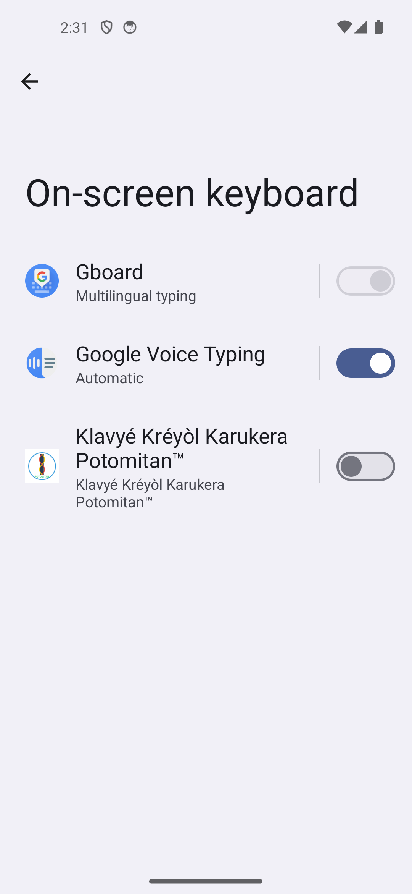
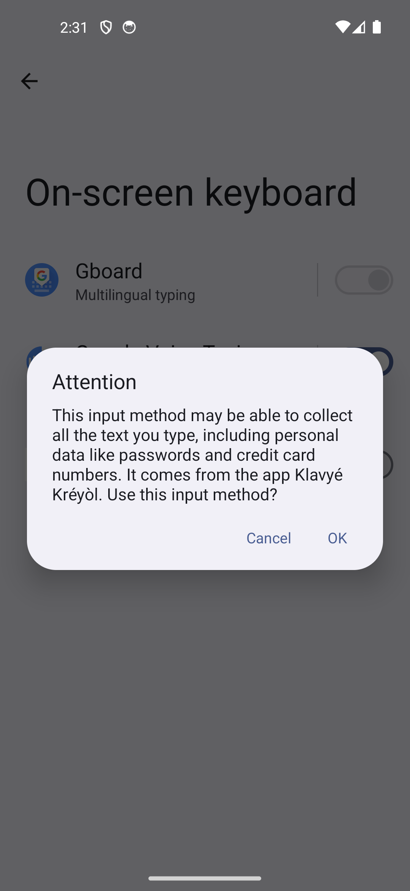
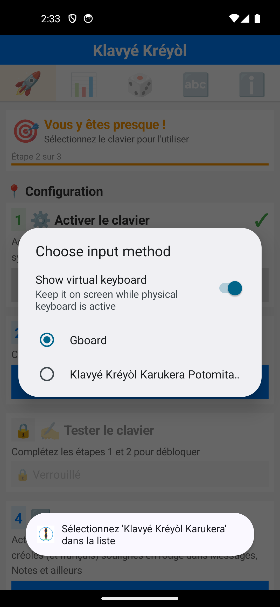
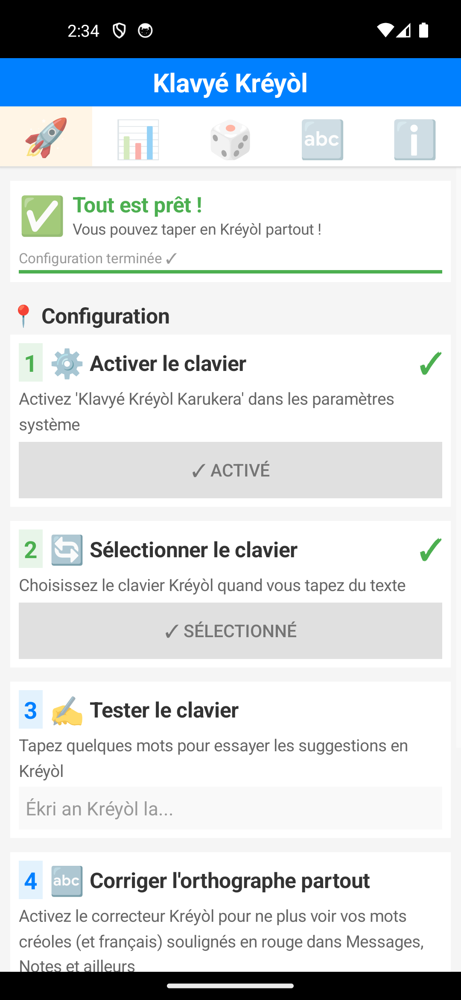

# Rapport UX — Parcours d'installation et d'activation du clavier Klavyé Kréyòl

**Date :** 11 juillet 2026
**Testeur :** Claude Code (agent), à la demande de l'utilisateur
**Version testée :** 7.0.3
**Méthode :** inspection du code (`SettingsActivity.kt`, `AndroidManifest.xml`, `docs/`, `KreyolKeybPlayStore/`) croisée avec un parcours live sur émulateur (AVD `kreyol_test`, Pixel 5, Android 14) après **désinstallation + désactivation forcée de l'IME côté système**, pour reproduire fidèlement l'état d'un appareil qui n'a jamais eu l'app — ce que l'émulateur de test réutilisé sur cette session n'était plus, ses réglages système ayant persisté d'un test précédent malgré une simple désinstallation.

Ce rapport complète `rapport_ux.md` (audit général des écrans) en se concentrant spécifiquement sur le **tunnel d'activation** : du premier lancement post-install Play Store jusqu'au premier mot tapé avec le clavier actif ailleurs que dans l'app.

## 1. Résumé exécutif

1. **L'utilisateur affronte deux avertissements système consécutifs, pas un seul** — et l'app ne prépare à aucun des deux. Le premier ("ce clavier peut collecter tout ce que vous tapez, y compris mots de passe et numéros de carte") est le plus dissuasif de tout le parcours ; le second, moins connu, avertit que l'app sera indisponible tant que le téléphone n'est pas déverrouillé après un redémarrage.
2. **La politique de confidentialité — complète, rassurante, "zéro collecte" — n'est reliée nulle part** : ni dans l'app, ni dans la fiche Play Store, ni au moment précis où l'avertissement système fait le plus peur.
3. **Le libellé du clavier est tronqué dans les écrans système** ("Klavyé Kréyòl Karukera Potomita…") faute de place — visible aussi bien dans la liste des claviers que dans le sélecteur.
4. **Deux fonctions de statut plus visibles ont été codées puis jamais branchées** (`createActivationBanner()`, `createStatusBar()`) : le signal qu'une meilleure mise en avant de l'état d'activation avait été envisagée, sans être finalisée.
5. **La confirmation de succès existe et est bien faite** ("Tout est prêt ! Vous pouvez taper en Kréyòl partout !") — mais elle n'apparaît que si l'utilisateur revient dans l'app ; rien ne le signale s'il quitte directement vers Messages ou une autre app après la sélection.
6. **Aucun tip contextuel au premier usage réel** : l'astuce accents longue-pression n'existe que dans la carte de succès de l'app, jamais montrée quand le clavier apparaît pour la première fois dans un vrai champ de saisie ailleurs.
7. **La checklist d'activation elle-même est bien conçue** : vérification d'état en temps réel (pas de simple "je te fais confiance"), déblocage progressif des étapes, boutons qui déclenchent exactement les bons écrans système. C'est la meilleure partie du parcours actuel.

## 2. Cartographie du parcours réel, étape par étape

### 2.1 Premier lancement

Pas de `MainActivity` : `SettingsActivity` (seule Activity `LAUNCHER` du manifest) s'ouvre directement sur l'onglet « 🚀 Démarrage », `Étape 1 sur 3`, avec un bouton unique **OUVRIR LES PARAMÈTRES**.

### 2.2 Écran système « Clavier virtuel »

`openKeyboardSettings()` (`SettingsActivity.kt:1493`) lance `Intent(Settings.ACTION_INPUT_METHOD_SETTINGS)`. L'utilisateur atterrit sur la liste des claviers du téléphone, avec le nôtre éteint, à côté de Gboard et Google Voice Typing.

### 2.3 Premier avertissement système (le plus critique du parcours)

Dès que l'utilisateur bascule l'interrupteur, Android affiche un dialogue **générique et non personnalisable par l'app** :

> **Attention** — This input method may be able to collect all the text you type, including personal data like passwords and credit card numbers. It comes from the app Klavyé Kréyòl. Use this input method?

Rien dans le parcours ne prépare à ce moment. C'est le point de friction le plus élevé de tout le tunnel — l'endroit où un utilisateur prudent (le public visé, personnes soucieuses de confidentialité) abandonne, alors que le projet a précisément une politique « zéro collecte » à faire valoir ici.

### 2.4 Second avertissement système, inattendu

Après avoir validé le premier, **un second dialogue apparaît immédiatement**, sans lien apparent avec le premier :

> **Note:** After a reboot, this app can't start until you unlock your phone.

Cause technique : `AndroidManifest.xml` ne déclare `android:directBootAware` nulle part (ni sur `<application>`, ni sur le service IME), donc l'app est traitée par défaut comme incompatible avec le stockage chiffré avant déverrouillage — comportement standard Android pour toute app dans ce cas, pas un bug introduit par le code du projet, mais un **second choc inattendu** dans une séquence déjà tendue. La plupart des utilisateurs n'ont jamais vu ce message et ne savent pas à quoi il correspond.

L'IME apparaît enfin activé dans la liste :

### 2.5 Retour dans l'app — détection automatique

L'utilisateur revient (bouton retour du téléphone) : l'app a déjà détecté le changement d'état par elle-même — carte « Vous y êtes presque ! », étape 1 cochée ✓ ACTIVÉ, étape 2 débloquée. Ce rafraîchissement automatique (`isKeyboardEnabled()`/`isKeyboardSelected()` revérifiés à `onResume()` et par un polling toutes les 2s tant que l'onglet est visible, `startPeriodicRefresh`, l.2229) fonctionne bien et évite à l'utilisateur de devoir cliquer sur un bouton « J'ai fini ».

### 2.6 Sélection du clavier — libellé tronqué

`openInputMethodPicker()` (l.1516) appelle `imm.showInputMethodPicker()`. Le sélecteur système liste Gboard et notre clavier — mais le nom est coupé :

> Klavyé Kréyòl Karukera Potomita…

Le nom affiché dans les réglages système est en réalité « Klavyé Kréyòl Karukera Potomitan™ » (label de l'IME dans le manifest), plus long que celui utilisé dans les textes d'onboarding de l'app (« Klavyé Kréyòl Karukera », sans « Potomitan™ »). Un utilisateur qui scanne rapidement la liste ne voit ni le nom exact annoncé par l'app, ni le nom complet.

### 2.7 Confirmation de succès — bien faite, mais seulement si l'utilisateur revient

Une fois le clavier sélectionné, l'utilisateur qui revient dans l'app voit :

> **Tout est prêt !** Vous pouvez taper en Kréyòl partout ! — Configuration terminée ✓

C'est un bon écran, clair, positif. Mais **rien ne le montre à l'utilisateur qui ne revient pas dans l'app** — par exemple s'il change de clavier directement depuis la barre système (appui long sur la barre d'espace) puis va droit dans Messages : aucun Toast, aucune notification, aucun signal ne confirme jamais explicitement que tout est en ordre en dehors de ce retour volontaire dans l'app.

### 2.8 Premier usage réel du clavier

Le champ de test intégré (« Tester le clavier », hint `Ékri an Kréyòl la…`) fait apparaître le clavier pour la première fois :

Rien à l'écran n'indique la fonctionnalité d'accents par appui long (`AccentHandler`) — elle n'est mentionnée que dans le texte de la carte « Tout est prêt ! » de l'onglet Démarrage, jamais affichée au niveau du clavier lui-même, ni ici ni la première fois que l'utilisateur tape réellement dans une autre app (Messages, Notes…).

## 3. Constats détaillés

### 3.1 Aucune préparation à l'avertissement système Android — le point le plus critique

Recherche exhaustive dans le code de l'app (`android_keyboard/app/src/main/`) : zéro occurrence de « privacy »/« confidentialité ». Rien n'anticipe le dialogue « collecte de données » avant qu'il n'apparaisse, alors que c'est prévisible et systématique (Android l'affiche pour **tout** IME tiers, sans exception).

### 3.2 Politique de confidentialité complète mais orpheline

`docs/privacy/PRIVACY_POLICY_FR.md` (856 lignes) et `privacy-policy.html` existent, sont à jour (v2.0), détaillent précisément le stockage 100% local, le zéro-collecte, les permissions (`BIND_INPUT_METHOD`, `WRITE_USER_DICTIONARY`), la conformité RGPD. **Ce document n'est lié nulle part** : ni dans `SettingsActivity.kt`, ni dans `KreyolKeybPlayStore/texts/description.md`. Le contenu qui répondrait le mieux à la peur suscitée par le dialogue système (§3.1) existe déjà, il est juste invisible au bon moment.

### 3.3 Deux fonctions de statut mortes, signe d'une UX inachevée

- `createActivationBanner()` (`SettingsActivity.kt:1386`) — bandeau "Clavier non activé" / bouton "Activer maintenant" — **jamais appelée**.
- `createStatusBar(isEnabled, isSelected)` (l.899) — barre de statut compacte avec bouton d'action contextuel ("Activer →" / "Sélectionner →") — **jamais appelée**.
- Seule `createProgressBar()` (l.984, appelée l.617) est utilisée en pratique.

Deux implémentations alternatives d'un statut plus visible ont donc été écrites puis abandonnées au profit de la checklist actuelle — ce n'est pas gênant en soi, mais laisser ce code mort dans le fichier source (déjà signalé comme pattern récurrent par `rapport_ux.md`) complique la maintenance future de cet écran précis.

### 3.4 Nom de l'IME trop long pour les listes système

Le label déclaré (`android:label` de l'IME, probablement dans `strings.xml`/manifest) est « Klavyé Kréyòl Karukera Potomitan™ » — 33 caractères, systématiquement tronqué dans les listes système Android (§2.6, capture à l'appui). Les textes internes de l'app utilisent une version plus courte (« Klavyé Kréyòl Karukera »), créant une discordance entre ce que l'app annonce et ce que le système affiche réellement.

### 3.5 Textes d'onboarding non externalisés

Aucun texte de l'onglet Démarrage n'est dans `strings.xml` (qui ne contient que 9 entrées, toutes des noms d'app/service) — tout est en dur dans `SettingsActivity.kt`. Cela ferme la porte à une traduction (anglais, pour la diaspora ?) sans toucher au code, et complique les tests unitaires de contenu.

### 3.6 Fiche Play Store silencieuse sur le parcours réel

`KreyolKeybPlayStore/texts/description.md` promet une « installation simple en 2 minutes » et met en avant le zéro-collecte, mais ne prépare à aucune des étapes réelles (Paramètres > Langues et saisie, ni les deux dialogues système). Un futur utilisateur qui lit la fiche avant d'installer n'a aucune idée de ce qui l'attend.

### 3.7 Aucun onboarding contextuel dans le clavier lui-même

Aucune détection de « première frappe réelle » nulle part dans le code (recherche de patterns `first_run`/`isFirstTime` infructueuse). Le seul contenu pédagogique (accents longue-pression) est enfermé dans l'onglet Démarrage de l'app, jamais poussé au moment où il serait le plus utile : la première fois que l'utilisateur tape réellement quelque part.

## 4. Ce qui fonctionne déjà bien

- **Vérification d'état en temps réel**, pas de simple déclaratif : `isKeyboardEnabled()`/`isKeyboardSelected()` interrogent directement `InputMethodManager`/`Settings.Secure`, avec un polling 2s qui détecte le retour de l'utilisateur depuis les paramètres système sans action de sa part.
- **Déblocage progressif** des étapes (l'étape 2 est verrouillée tant que l'étape 1 n'est pas faite, etc.) — évite de perdre l'utilisateur dans un ordre incorrect.
- **Les boutons déclenchent exactement les bons Intents système** (`ACTION_INPUT_METHOD_SETTINGS`, `showInputMethodPicker()`) — pas de détour, pas d'écran intermédiaire inutile.
- **L'écran de succès final est positif et clair** une fois qu'on y arrive.

## 5. Propositions d'amélioration, priorisées

| # | Proposition | Constat lié | Effort estimé |
|---|---|---|---|
| 1 | **Ajouter une carte explicative juste avant le bouton « Ouvrir les paramètres »** : une phrase du type *« Android va vous montrer un avertissement standard affiché pour tous les claviers tiers — nous ne collectons rien, tout reste sur votre téléphone »* + un lien cliquable vers la politique de confidentialité déjà écrite. | §3.1, §3.2 | Faible — texte + `Intent(ACTION_VIEW)` vers l'URL déjà publiée |
| 2 | **Lier la politique de confidentialité depuis l'onglet « À Propos »** et depuis la fiche Play Store (`description.md`), au minimum. | §3.2, §3.6 | Très faible |
| 3 | **Raccourcir ou clarifier le label système de l'IME** (retirer « Potomitan™ » du label affiché dans les listes système, le garder pour le branding interne) pour qu'il ne soit plus tronqué et corresponde au nom utilisé dans les textes d'onboarding. | §3.4 | Faible — modification du label déclaré, à valider avec l'identité de marque |
| 4 | **Ajouter une confirmation de succès qui ne dépend pas du retour dans l'app** : un `Toast` ou une notification légère déclenchée dès que `isKeyboardEnabled() && isKeyboardSelected()` devient vrai (détectable par un `ContentObserver` sur `Settings.Secure.DEFAULT_INPUT_METHOD` plutôt que seulement du polling en foreground). | §3.5, §2.7 | Moyen |
| 5 | **Supprimer ou finaliser `createActivationBanner()`/`createStatusBar()`** — code mort qui alourdit `SettingsActivity.kt` sans bénéfice utilisateur. | §3.3 | Faible |
| 6 | **Tip contextuel au premier usage réel** : une notification ou un overlay léger déclenché une seule fois (flag `SharedPreferences`) lors de la première frappe détectée hors de l'app, rappelant l'astuce accents longue-pression. | §3.7 | Moyen — nécessite une détection de premier usage dans l'IME lui-même |
| 7 | *(Optionnel, faible priorité)* Envisager `android:directBootAware="true"` sur le service IME pour supprimer le second dialogue — complexité et implications sécurité à évaluer avant de s'engager (accès au stockage chiffré par les identifiants uniquement) ; à documenter au moins dans la carte d'explication du point 1 si non traité. | §2.4 | Élevé / à évaluer |

## Conclusion

Le tunnel d'activation du Klavyé Kréyòl repose sur une base technique solide — détection d'état en temps réel, déblocage progressif, bons Intents système — mais laisse l'utilisateur seul face aux deux moments les plus anxiogènes du parcours : les deux avertissements système consécutifs, dont le premier est exactement celui qu'une politique de confidentialité « zéro collecte » déjà rédigée pourrait neutraliser, si elle était montrée au bon endroit. Les corrections les plus rentables (liens vers la politique de confidentialité, phrase d'explication avant l'avertissement, nettoyage du code mort) sont à faible effort et s'attaquent directement au point où un utilisateur prudent — précisément le public que ce projet cherche à rassurer — est le plus susceptible d'abandonner.
