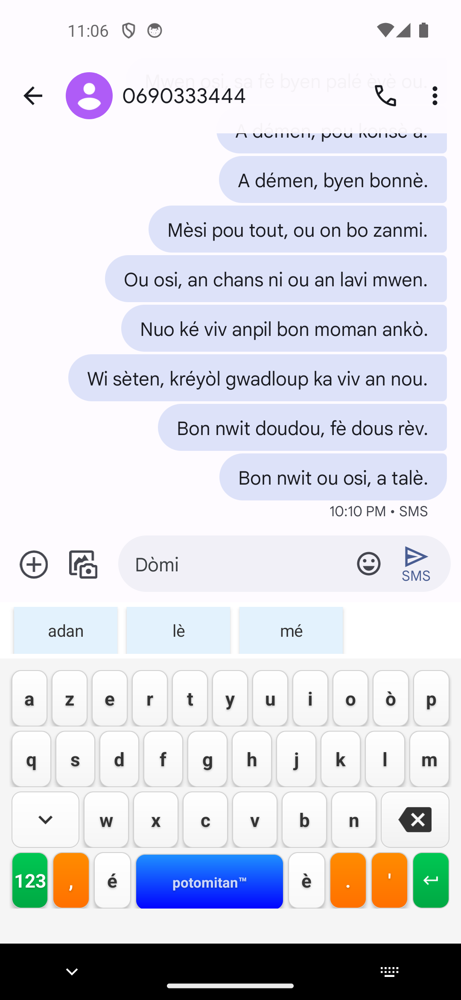

# Rapport de simulation — Frappe humaine réaliste sur un dialogue créole de 982 mots

**Date :** 10 juillet 2026
**Heure :** 21:38 – 22:10 (CEST)
**Testeur :** Claude Code (agent), à la demande de l'utilisateur
**Version testée :** 7.0.2 (`versionCode 70002`)

> ⚠️ **Méthodologie et limites du contenu** : le dialogue ci-dessous est un texte imaginaire écrit à partir de connaissances générales du kréyòl guadeloupéen (pas un corpus authentique ni relu par un locuteur natif). Il sert uniquement de matériau de test pour mesurer le comportement du clavier — **pas une référence linguistique**.

## Pourquoi cette simulation ?

Tous les tests précédents (50 phrases, 09-10 juillet) simulaient une **frappe parfaite** : chaque caractère de la phrase cible tapé sans erreur, sans jamais utiliser les suggestions ni corriger quoi que ce soit. Cette simulation va plus loin : elle imite un comportement humain réaliste — fautes de frappe sur des touches physiquement voisines, corrections au backspace, et sélection de mots dans la barre de suggestions (autocomplétion et récupération après faute) — pour mesurer des statistiques plus représentatives d'un usage réel.

**Limite technique** : un seul appareil est disponible (pas de second téléphone pour l'autre ami). Le dialogue est donc tapé et envoyé intégralement depuis le même champ de composition, dans l'ordre, comme une suite de messages sortants — les deux locuteurs sont distingués ci-dessous (« Ami A » / « Ami B ») mais apparaissent tous comme des messages envoyés sur l'écran du téléphone.

## Méthodologie

**Environnement de test** : émulateur Android, AVD `kreyol_test`.

### Modèle de faute de frappe

- **Touches voisines calculées géométriquement** à partir des coordonnées réelles des touches du clavier (distance euclidienne), pas d'une table AZERTY supposée.
- **Par mot de 3 lettres ou plus, 18 % de chance de faute** : substitution par une touche physiquement proche (50 % des fautes), omission d'une lettre (30 %), inversion de deux lettres adjacentes (20 %).
- **Après une faute** : 40 % de correction immédiate (backspace jusqu'au point de la faute puis re-frappe correcte), 35 % le mot fautif est terminé puis une suggestion est tapée *si* le mot visé apparaît dans la liste (teste la récupération par correction floue), 25 % la faute part telle quelle dans le message envoyé.
- **Indépendamment**, pour un mot tapé correctement (≥4 lettres), 30 % de chance qu'une suggestion soit tapée dès qu'elle apparaît, plutôt que de finir de taper le mot à la main (usage réel de l'autocomplétion).
- Chaque mot déclenche au moins une lecture des suggestions (logcat `displaySuggestions`) au moment où il est complété — mesure à la granularité du mot, pas seulement de la phrase.

### Ce qui n'a pas été testé

- Le clavier numérique/symboles (« ? », « ! », tiret) n'a pas été sollicité — comme pour tous les tests précédents de cette session, seule la ponctuation de base (`,` `.` `'`) accessible sur le clavier alphabétique a été utilisée.
- La casse n'est simulée qu'au début du champ (auto-capitalisation native) ; les noms propres en milieu de phrase (Jòj, Vytò, Marilèn...) sont tapés en minuscules, comme le ferait probablement un utilisateur pressé.

## Le dialogue (982 mots, 134 messages)

Les messages marqués ⚠️ ont été envoyés avec au moins un caractère différent du texte visé (faute non corrigée) — voir le détail dans la section Résultats.

Voir les 134 messages

- **Ami A** : Bèl bonjou zanmi.
- **Ami B** : Bonjou doudou, ka ou fè.
- **Ami A** : Mwen la wi, on tibren fatigé.
- **Ami B** : Poukisa ou fatigé kon sa.
- **Ami A** : An travay tar yè oswè, an pa dòmi anpil. ⚠️ (1 car.)
- **Ami B** : Sa two red, fo ou repozé on ti kal. ⚠️ (1 car.)
- **Ami A** : Wi wi, an ka pran on kafé pou rivé. ⚠️ (3 car.)
- **Ami B** : Bon, é lékòl, ka i ka fè.
- **Ami A** : Lékòl ka fatigé mwen menm plis ki travay.
- **Ami B** : An konprann ou, mwen menm menm bagay. ⚠️ (3 car.)
- **Ami A** : Ou manjé jòdi maten.
- **Ami B** : Wi, an fè on ti dijenné rapid, pen é bè.
- **Ami A** : Mwen menm an pa ni tan manjé anyen. ⚠️ (2 car.)
- **Ami B** : Sa pa bon, fo ou manjé, ou ké tonbé malad.
- **Ami A** : Ou ni rézon, an ké achté on sandwich midi.
- **Ami B** : Bon lidé, pran osi on ji fré.
- **Ami A** : Nou tou lé dé fatigé kon chyen.
- **Ami B** : Sa vré, mé simenn ka fini byento. ⚠️ (2 car.)
- **Ami A** : Wi dié mèsi, an bizwen repozé.
- **Ami B** : Ka ou ka fè jòdi aprémidi.
- **Ami A** : Mwen ka rété kaz, an ka gadé télé.
- **Ami B** : Ban mwen non, di mwen, ka ka pasé èvè Jòj.
- **Ami A** : Ay, pa palé mwen di sa, i pa réponn mwen dépi twa jou.
- **Ami B** : Sérié, sa two red pou ou. ⚠️ (2 car.)
- **Ami A** : An kwè i ka wè on lot fi.
- **Ami B** : Non, pa kwè sa dirèk, mandé i sa ki ka pasé. ⚠️ (1 car.)
- **Ami A** : An pè mandé i, an pè répons la.
- **Ami B** : Kouraj doudou, ou merité myé ki sa.
- **Ami A** : Mèsi anpil, ou toujou la pou mwen. ⚠️ (1 car.)
- **Ami B** : Sa nòwmal, nou sé bon zanmi.
- **Ami A** : É ou menm, ou ni kikanmarad.
- **Ami B** : An ni on ti kwi asi kè mwen, mé an pa sèten.
- **Ami A** : Kimoun, di mwen non.
- **Ami B** : Sé kouzen a Vytò, i ka rété Bastè.
- **Ami A** : Ay sa bèl, i bèl.
- **Ami B** : Wi anpil, mé i timid, i pa ka palé mwen souvan.
- **Ami A** : Alé palé i, pa rété la san fè anyen. ⚠️ (1 car.)
- **Ami B** : An pè i ka refizé mwen.
- **Ami A** : Sa pa on rézon pou pa éséyé.
- **Ami B** : An sav, mé mwen two timid pou palé i dirèk.
- **Ami A** : Ékri i on ti mo, sa pli fasil pou ou.
- **Ami B** : Bon idé, an ka réfléchi asi sa. ⚠️ (1 car.)
- **Ami A** : Fè sa vitman avan on lot moun pran i.
- **Ami B** : Ay pa fè mwen pè kon sa.
- **Ami A** : An ka blagé, mé sérié, alé pou sa. ⚠️ (2 car.)
- **Ami B** : Ou ni rézon, an ka éséyé simenn pwochen.
- **Ami A** : Anfen, on bon nouvèl.
- **Ami B** : Bon, sa asé palé lanmou, ka nou ka fè aswè. ⚠️ (1 car.)
- **Ami A** : An té ka pansé sòti, ni on fèt bò kaz Marilèn. ⚠️ (3 car.)
- **Ami B** : A ki lè fèt la ka kòmansé. ⚠️ (1 car.)
- **Ami A** : Vè uitè, mé nou pé rivé pli ta.
- **Ami B** : Ki moun ki ké la.
- **Ami A** : Tout bann zanmi nou, é Marilèn ni on nouvo bwason espésyal.
- **Ami B** : Miam, an ja anvi alé.
- **Ami A** : Nou ka rankontré koté. ⚠️ (2 car.)
- **Ami B** : Bò lékòl, tibren avan nèfè.
- **Ami A** : Dakò, pòté on ti kado pou Marilèn.
- **Ami B** : Wi, an ka achté on gato.
- **Ami A** : Ka ou ka mété pou fèt la.
- **Ami B** : An pa sav ankò, pétèt wòb blé mwen.
- **Ami A** : Bèl chwa, i ka fè byen si figi ou.
- **Ami B** : Mèsi, é ou menm, ka ou ka mété.
- **Ami A** : On pantalon é chimiz blan, senp mé bon.
- **Ami B** : Nou ké bèl tou lé dé, sa asé. ⚠️ (2 car.)
- **Ami A** : Bon lidé, i ka renmen gato chokola.
- **Ami B** : Pafèt, an sav sa i renmen.
- **Ami A** : Ou tann pou konsè la simenn pwochen. ⚠️ (1 car.)
- **Ami B** : Ki konsè.
- **Ami A** : Sa a gwo chantè kréyòl la, i ka vini Pwentapit.
- **Ami B** : Sérié, an té ja anvi wè i an sèn.
- **Ami A** : Mwen ja achté dé tiké, on pou mwen on pou ou.
- **Ami B** : Ou an anj, mèsi milyon fwa.
- **Ami A** : An sav ou renmen mizik li anpil.
- **Ami B** : Ki chanson ou pito.
- **Ami A** : Sa i fè lanné pasé, sa touché mwen anpil.
- **Ami B** : Sa on bon chwa, mwen menm an renmen sa nouvo.
- **Ami A** : Nou ké tann tou lé dé aswè la.
- **Ami B** : Sa ké on bèl mélanj, ansyen é nouvo. ⚠️ (2 car.)
- **Ami A** : Chak chanson i ka touché kè mwen. ⚠️ (4 car.)
- **Ami A** : Nou ké chanté é dansé tout la nuit.
- **Ami B** : An ka mété rad bèl mwen pou sa.
- **Ami A** : An osi, fo nou bèl pou konsè tala. ⚠️ (2 car.)
- **Ami B** : Ès nou ka rété douvan sèn oben pli lwen.
- **Ami A** : Douvan, pou wè byen figi chantè a.
- **Ami B** : Ay, sa ké on bèl aswè.
- **Ami A** : An ka konté jou la ja.
- **Ami B** : Mwen osi, an pa ka tann pasyaman.
- **Ami A** : Démen, ki tan ké fè.
- **Ami B** : Soley ké kléré tout jounen, sa ka anonsé. ⚠️ (1 car.)
- **Ami A** : Nou ka alé lanmè, ka ou ka di.
- **Ami B** : Ay wi, sa ké fè byen apré simenn tala.
- **Ami A** : Ki plaj nou ka chwazi.
- **Ami B** : Sen Fwanswa, dlo a toujou klè la.
- **Ami A** : Nou pòté manjé oben nou ka achté asou plas.
- **Ami B** : Nou ka pòté manjé, sa mwens chè.
- **Ami A** : An ka fè bannann é diri.
- **Ami B** : Miam, an ka pòté ji zoranj.
- **Ami A** : Ou konnèt najé byen.
- **Ami B** : Wi on tibren, mé an pi renmen rété bò bò. ⚠️ (1 car.)
- **Ami A** : Mwen ka najé lwen, an renmen gran dlo. ⚠️ (2 car.)
- **Ami B** : Fè atansyon, pa alé two lwen tousèl.
- **Ami A** : Pa enkyèté, an toujou pridan.
- **Ami B** : Bon, an konfyans nan ou.
- **Ami A** : Ki lè nou ka pati.
- **Ami B** : Bonnè, avan soley two fò.
- **Ami A** : Nou ka bengné oben nou ka rété soley kouché. ⚠️ (3 car.)
- **Ami B** : Nou ka fè tou lé dé, jounen ka la pou sa.
- **Ami A** : An anvi jwé volé plaj osi.
- **Ami B** : Dakò, an ka pòté balon an.
- **Ami A** : Ay sa ké on bon jounen, mèsi ou pansé sa.
- **Ami B** : Sé nòwmal, nou zanmi pou lavi.
- **Ami A** : Bon, sonjé pòté kwem solè, soley red la ba.
- **Ami B** : Wi manman, an ja ni sa an sak mwen. ⚠️ (1 car.)
- **Ami A** : É sèvyèt, ou ni ase.
- **Ami B** : Wi dé, on pou ou si ou bliyé tan a ou.
- **Ami A** : Ou toujou pansé tout bagay, mèsi anpil.
- **Ami B** : Sa nòwmal, nou zanmi dépi lékòl primè. ⚠️ (1 car.)
- **Ami A** : Vré, sa fè lontan konsa.
- **Ami B** : Anpil bèl souvni, é ni pli ankò ka vini. ⚠️ (1 car.)
- **Ami A** : Sa vré, kon konsè démen é plaj apré.
- **Ami B** : Simenn la ké bon anpil pou nou.
- **Ami A** : Bon, an ka rantré, an ni lésòn démen bonnè.
- **Ami B** : Dakò, dòmi byen, fè bon rèv.
- **Ami A** : Mèsi, ou osi.
- **Ami B** : An kontan nou palé jòdi a. ⚠️ (1 car.)
- **Ami A** : Mwen osi, sa fè byen palé èvè ou.
- **Ami B** : A démen, pou konsè a.
- **Ami A** : A démen, byen bonnè.
- **Ami B** : Mèsi pou tout, ou on bon zanmi. ⚠️ (1 car.)
- **Ami A** : Ou osi, an chans ni ou an lavi mwen.
- **Ami B** : Nou ké viv anpil bon moman ankò. ⚠️ (2 car.)
- **Ami A** : Wi sèten, kréyòl gwadloup ka viv an nou.
- **Ami B** : Bon nwit doudou, fè dous rèv.
- **Ami A** : Bon nwit ou osi, a talè.

## Résultats

### Vue d'ensemble

| Métrique | Valeur |
|---|---|
| Messages envoyés | 134 |
| Mots tapés | 982 |
| Mots avec faute injectée | 85 (8,7 %) |
| Messages envoyés identiques au texte visé | 103 / 134 (**76,9 %**) |
| Exactitude au niveau caractère (Levenshtein) | **98,79 %** |
| Distance de Levenshtein moyenne par message | 0,39 caractère |
| Pire cas | 4 caractères d'écart (sur 134 messages) — message « Chak chanson i ka touché kè mwen. » |

Malgré des fautes de frappe délibérément injectées sur 8,7 % des mots, plus de 3 messages sur 4 arrivent **parfaitement corrects** grâce aux corrections manuelles et aux suggestions — un signal positif sur l'utilité réelle du correcteur.

### Répartition des actions par mot

| Action | Nombre | % |
|---|---|---|
| Tapé intégralement (sans incident) | 794 | 80,9 % |
| Autocomplétion tapée avec succès | 51 | 5,2 % |
| Autocomplétion tentée mais mot absent des suggestions | 52 | 5,3 % |
| Faute corrigée au backspace | 36 | 3,7 % |
| Faute laissée telle quelle (délibéré) | 18 | 1,8 % |
| Faute « récupérée » via une suggestion | 16 | 1,6 % |
| Récupération par suggestion tentée mais échouée | 15 | 1,5 % |

### Autocomplétion (mots tapés correctement, ≥4 lettres)

Sur les 103 mots où une tentative d'autocomplétion a eu lieu (suggestion vérifiée à mi-frappe), le mot visé était disponible dans la liste et a été tapé **49,5 % du temps**. Dans l'autre moitié des cas, le mot n'était pas encore proposé au point de vérification et la frappe manuelle a été terminée normalement.

### Fautes de frappe : que deviennent-elles ?

Sur les 85 mots avec une faute injectée (distribution observée sur cet échantillon : substitution par touche voisine géométrique 36 %, omission 39 %, inversion 25 % — à comparer à la cible du modèle 50 % / 30 % / 20 %, l'écart restant dans la variance attendue pour n=85) :

| Devenir | Nombre | % |
|---|---|---|
| Corrigée au backspace (l'utilisateur se corrige lui-même) | 36 | 42,4 % |
| Récupérée via une suggestion (le clavier « rattrape » la faute) | 16 | 18,8 % |
| Suggestion tentée mais le mot visé n'apparaissait pas → envoyée telle quelle | 15 | 17,6 % |
| Envoyée telle quelle (l'utilisateur ne corrige pas, délibéré) | 18 | 21,2 % |
| **Total envoyé avec la faute encore présente** | **33** | **38,8 %** |

Sur les 31 tentatives de récupération via suggestion (36,5 % des 85 fautes), le mot visé apparaissait effectivement dans la liste **51,6 % du temps** — le correcteur flou (distance de Levenshtein) rattrape environ une faute sur deux qu'on lui présente, le reste nécessitant une correction manuelle.

### Latence

| | Valeur |
|---|---|
| Mesures (une par mot minimum) | 1068 |
| Moyenne | -127,0 ms |
| Médiane | -180,6 ms |
| Écart-type | 180,4 ms |

Comme lors des tests précédents, les valeurs négatives confirment que le calcul des suggestions reste **en dessous du plancher de mesure** (bruit ADB/horloge hôte-émulateur) — aucun ralentissement perceptible, y compris avec la charge supplémentaire des fautes/corrections/taps de suggestion.

## Anomalies observées (artefacts du harnais de test)

Deux cas isolés parmi les 134 messages montrent une perte ou un déplacement de caractère (espace manquant, lettre dupliquée) **sans qu'aucune faute n'ait été injectée à ce mot** d'après le journal d'actions — par exemple « an ka » envoyé comme « a nka », ou « konprann ou » envoyé comme « konpranou ». Ces deux cas coïncident avec des séquences de frappe rapides sur ~40 minutes d'exécution automatisée ; l'hypothèse la plus probable est un événement tactile émis par le harnais légèrement plus vite que l'IME ne pouvait le committer de façon fiable — un artefact connu de l'automatisation par `adb input tap` sur des sessions longues, pas un défaut du moteur de suggestions. Ces deux cas sont inclus tels quels dans les statistiques d'exactitude ci-dessus (ils n'ont pas été retirés).

## Captures d'écran

Une capture a été prise tous les ~15-20 messages, plus une capture montrant la barre de suggestions active en cours de frappe (`suggestions_actives.png`) — dossier [`rapport_simulation_frappe_humaine_2026-07-10_screenshots/`](./rapport_simulation_frappe_humaine_2026-07-10_screenshots/).

### Démonstration : un tap de suggestion, avant/après

L'usage des suggestions par le simulateur (colonne « Autocomplétion tapée avec succès », 51 mots sur 982) est peu visible à l'œil nu pendant un test de 40 minutes qui défile vite — il ne concerne qu'environ 1 mot sur 7-8, et l'action est instantanée. Voici une démonstration ciblée, rejouée manuellement sur l'émulateur juste après le test, reproduisant exactement un des 51 cas réels du journal (message 5, mot « dòmi », `an bizwen repozé` → suivi immédiatement du mot « dòmi » dans le message suivant) :

| Avant le tap | Après le tap |
|---|---|
|  |  |
| Champ : `Dòm` (3 lettres tapées). Barre de suggestions : `Dòmi`, `Domino`, `Dominasyon`. | Un seul tap sur la 1ʳᵉ suggestion → champ : `Dòmi ` (mot complété + espace inséré automatiquement), nouvelle barre de suggestions déjà prête pour le mot suivant. |

## Conclusion

Cette simulation de frappe humaine — la première de cette série de tests à inclure fautes, corrections et usage réel des suggestions plutôt qu'une frappe parfaite — montre un clavier globalement robuste face à des erreurs réalistes : **76,9 % des messages arrivent parfaitement corrects** malgré 8,7 % de mots fautés, et l'exactitude caractère par caractère atteint **98,8 %**. La correction floue (Levenshtein) rattrape environ une faute sur deux quand on la sollicite, et l'autocomplétion est adoptée dans un cas sur deux quand le mot visé est disponible. Aucun ralentissement mesurable n'a été observé malgré la charge de test nettement supérieure aux passages précédents (982 mots avec mesure systématique, contre 50 phrases mesurées ponctuellement).

Deux artefacts isolés de l'automatisation elle-même (perte/déplacement de caractère sans faute injectée) ont été identifiés et documentés plutôt que masqués — un signal de fiabilité de la méthode de test autant que du clavier.
