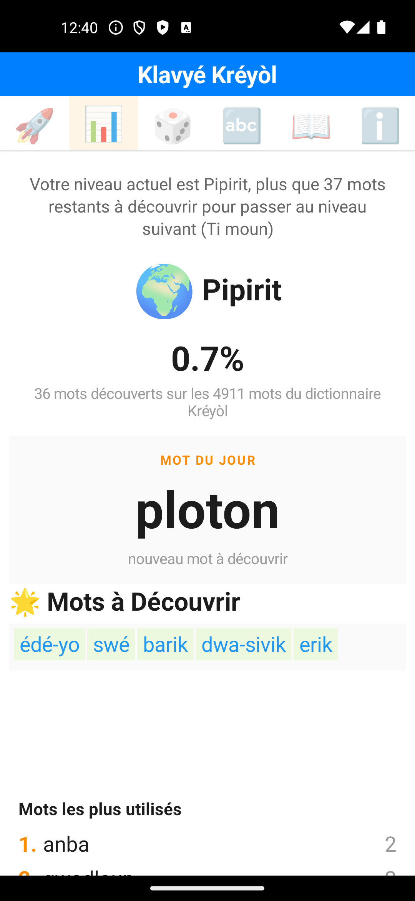
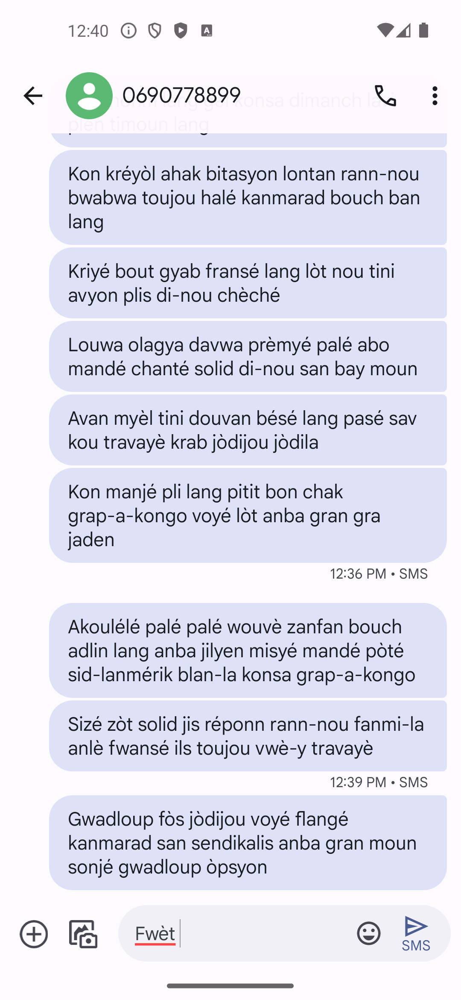
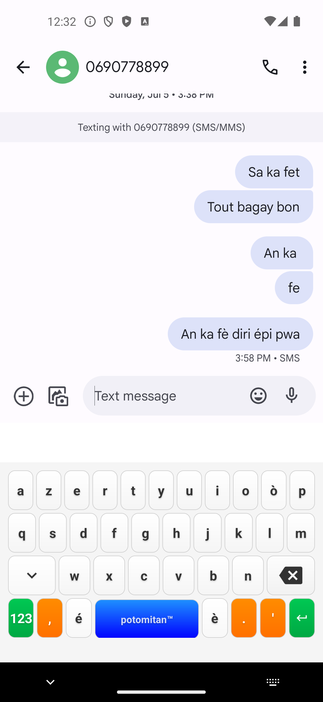
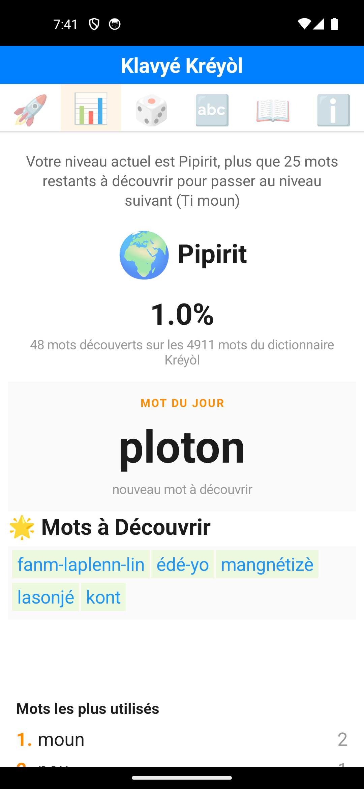
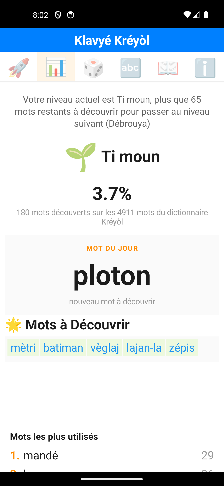
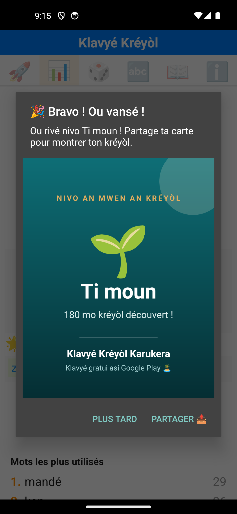
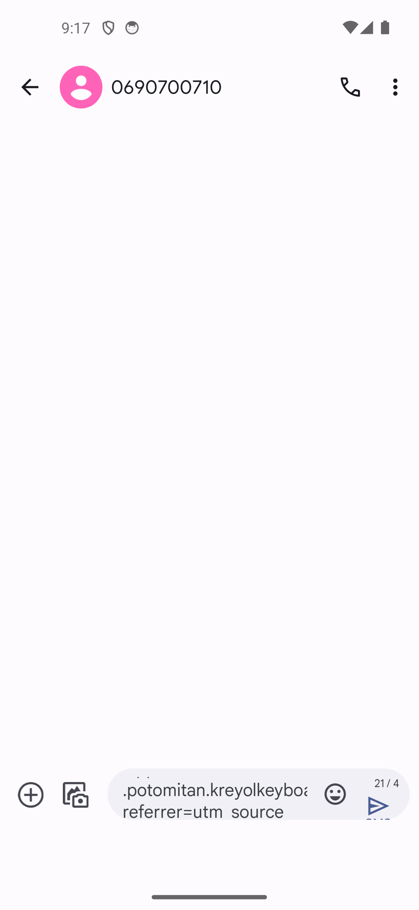
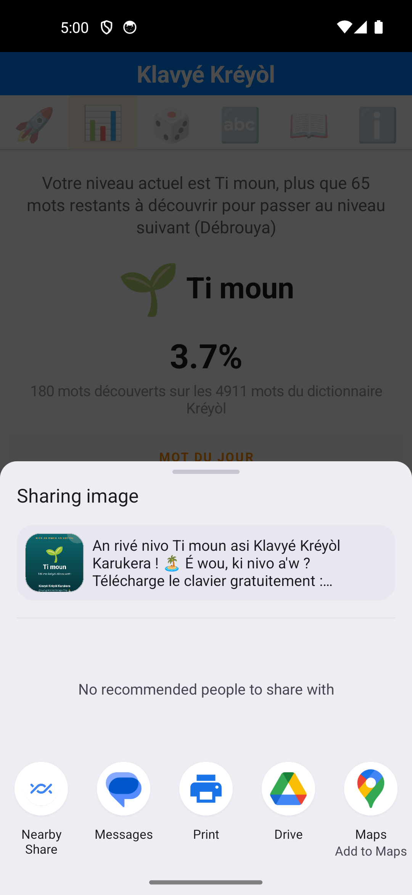
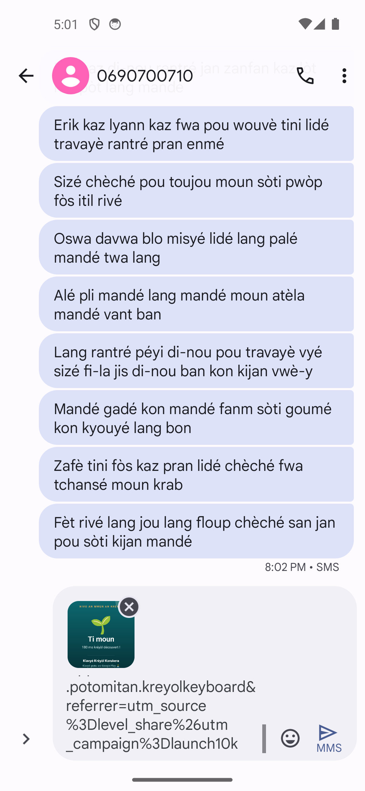
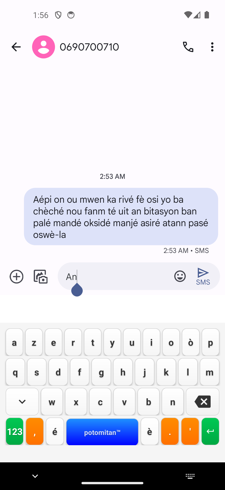

# Rapport d'investigation : Simulation SMS de progression de niveau et partage

**Date :** 13 juillet 2026
**Testeur :** Claude Code (agent, modèle Sonnet 5), à la demande de l'utilisateur
**Version testée :** 7.0.10 (`versionCode 70010`)
**Environnement :** émulateurs Android `kreyol_test` puis `kreyol_playstore`, conversations SMS dédiées dans Google Messages, script Python jetable (`scratchpad/simulate_sms_progression.py`, non committé).

> ✅ **Statut : run complet de 600 mots mené à bien** après correction du bug de clavier (voir addendum). 600 mots tapés strictement via suggestions, 12 checkpoints de progression, zéro crash, zéro ANR. Le run révèle un enseignement produit important sur la courbe de progression (un seul des trois niveaux attendus s'est débloqué) et une limite du harnais de test sur le flux de partage. Détails dans la section « Résultats du run complet » ci-dessous. Les sections qui suivent immédiatement documentent d'abord la phase de mise au point (calibration, stratégie de frappe, bug de clavier) qui a précédé ce run.

## Objectif

Vérifier la fluidité de bout en bout de deux mécanismes de croissance ajoutés récemment : la progression de niveau (Pipirit → Benzo) et la carte de niveau partageable. Le protocole prévu : un utilisateur qui échange des SMS en tapant exclusivement via les suggestions du clavier (jamais un mot terminé à la main), avec un contrôle de la progression toutes les 50 tapes et un partage automatique à chaque niveau débloqué.

## Ce qui a été construit et validé

### Calibration complète du clavier personnalisé

Le clavier Klavyé Kréyòl est rendu via des `Button` custom (pas le `KeyboardView` standard Android), et son arborescence de vues est invisible à `uiautomator dump` (limitation connue des claviers logiciels sous Android). La seule méthode fiable pour le piloter par script est le tap à coordonnées calibrées, avec vérification via `adb logcat` (tags `KreyolIME-Potomitan™`, `InputProcessor`, `CreoleDictUsage`). Coordonnées calibrées et confirmées par lecture de bordures de touches sur capture d'écran (device 1080×2340) :

| Élément | Coordonnées |
|---|---|
| Rangée 1 (a z e r t y u i o ò p) | y = 1632 |
| Rangée 2 (q s d f g h j k l m) | y = 1776 |
| Rangée 3 (w x c v b n) | y = 1918 |
| Barre de suggestions (3 slots) | y = 1475, x = 153 / 418 / 681 |
| Espace | (538, 2057) |
| Retour arrière | (971, 1918) |

### Stratégie de frappe fiable

Deux bugs de méthodologie ont été identifiés et corrigés avant d'obtenir une frappe fiable :

- **`adb shell input text`** contourne complètement la logique interne du clavier (utilise `commitText()` direct) : aucune suggestion n'est générée. Il faut simuler de vrais taps sur les touches à l'écran.
- **`adb shell input keyevent 67`** (retour arrière physique) ne synchronise pas non plus le suivi interne du mot en cours (`currentWord` dans `InputProcessor`) : seul un tap sur la touche retour arrière *affichée à l'écran* déclenche `deleteSurroundingText()` **et** met à jour le mot suivi.

Un bug applicatif réel a aussi été découvert : `MIN_WORD_LENGTH = 3` dans `CreoleDictionaryWithUsage.kt` fait que les mots de 1 à 2 lettres (ka, ou, on, an…) ne comptent **jamais** dans `wordsDiscovered`, même committés via une vraie suggestion. Une conversation réaliste utilise beaucoup ces mots courts et très fréquents, ce qui aurait fait stagner artificiellement la progression. Le script a donc été adapté pour amorcer chaque frappe à partir des 2 premières lettres d'un vrai mot du dictionnaire (`creole_dict.json`) de 3 lettres ou plus, ce qui garantit des suggestions pertinentes et comptabilisées.

Résultat : plusieurs runs de contrôle (3, 6, 8, 40 puis 80 mots) ont produit des commits **exactement conformes** aux suggestions lues en direct dans le logcat, avec 0 mot fantôme après correction d'une course de vitesse (le log `Mot committé pour tracking` peut apparaître jusqu'à ~400 ms après le tap ; un seul relevé immédiat pouvait le rater et faire croire à un échec alors que le mot était bien enregistré).

### Lecture fiable de l'écran de progression

`SettingsActivity` ne recharge `loadVocabularyStats()` que si l'activité est réellement recréée : un simple `am start` sur une instance déjà ouverte ramène l'ancien affichage au premier plan sans relire le fichier d'usage. Fix : lancer avec `--activity-clear-task --activity-clear-top`. Avec ce correctif, le run de 80 mots a affiché la progression exacte attendue (« 36 mots découverts » à mi-parcours, cohérent avec les commits comptés côté script).

### Navigation robuste entre Messages et l'app

Lors d'une boucle d'échecs prolongée (voir plus bas), le script s'est retrouvé, en tapant des coordonnées à l'aveugle, dans une conversation SMS totalement différente de celle prévue pour le test. Un garde-fou `ensure_test_conversation()` a été ajouté : avant de reprendre la frappe, le script relit l'écran (`uiautomator dump`) et vérifie que le numéro de la conversation de test y figure réellement, plutôt que de supposer qu'un simple relancement de Messages retombe au bon endroit.

## Le blocage : disparition intermittente du clavier virtuel

Le run de validation à 80 mots (calibré pour franchir le premier seuil de niveau, « Ti moun » à 73 mots) s'est arrêté après le premier checkpoint (40 mots) : le clavier a cessé de s'afficher à l'écran, pour l'application Klavyé Kréyòl **et** pour le clavier système Gboard testé en comparaison. Diagnostic mené :

- `dumpsys input_method` montrait `mBoundToMethod=true` mais **aucune ligne de log** portant les tags propres à l'app (`KreyolIME-Potomitan™`, `InputProcessor`, `SuggestionEngine`) : `onCreate()` du service IME (dont la toute première ligne est un `Log.d` inconditionnel) ne s'était jamais exécuté, malgré un processus vivant avec de la mémoire réellement allouée.
- Un redémarrage complet du système Android (`adb reboot`) n'a pas résolu le problème.
- Le changement d'AVD (`kreyol_test` → `kreyol_playstore`, deux profils d'émulateur distincts) a reproduit exactement le même symptôme, écartant une cause propre à un profil.
- Une désinstallation puis réinstallation complète de l'APK a débloqué la situation **une fois**, mais le même remède appliqué une seconde fois (après sauvegarde/restauration du fichier `creole_dict_with_usage.json` pour ne pas perdre la progression) n'a pas suffi : le clavier a de nouveau cessé de s'afficher après le checkpoint suivant.

L'environnement d'exécution était par ailleurs sous forte charge (`load average` jusqu'à 9 sur 6 cœurs pendant les tests, rendu logiciel `swiftshader_indirect`), un facteur aggravant plausible mais non confirmé comme cause unique : la panne survient de façon reproductible juste après un cycle de bind/unbind du service IME (déclenché par le passage à `SettingsActivity` puis retour à Messages lors de chaque checkpoint), ce qui évoque plutôt une protection anti-boucle de l'OS (le service refuse silencieusement de redémarrer après des cycles de liaison trop rapprochés) qu'un simple ralentissement.

## Résultats du run complet (600 mots)

Une fois le correctif du clavier appliqué (addendum) et l'hôte revenu à une charge normale, le run complet a été mené de bout en bout, le 13 juillet 2026 de 19h39 à 20h02 (environ 23 minutes) sur l'AVD `kreyol_test`.

Bilan brut :

- **600 / 600 mots** committés via suggestions uniquement, aucun mot terminé à la main.
- **253 mots uniques**, **347 répétitions** (un même mot retapé plusieurs fois compte comme répétition).
- **12 checkpoints** de progression lus avec succès, chacun via le cycle `SettingsActivity` puis retour à Messages.
- **Zéro crash, zéro ANR** sur toute la durée.

### Le correctif du clavier validé en conditions réelles répétées

Chaque checkpoint effectue exactement l'aller-retour d'application (`SettingsActivity` de Klavyé Kréyòl, puis retour à la conversation Messages, puis tap sur le champ de saisie) qui déclenchait de façon reproductible la disparition du clavier avant le correctif. **Les 12 checkpoints ont retrouvé un clavier fonctionnel**, ce qui constitue une validation du correctif `super.onFinishInput()` sur douze cycles consécutifs en conditions réalistes, au-delà des deux vérifications manuelles de l'addendum.

### Courbe de progression : un seul niveau débloqué sur les trois attendus

Seuils de niveau réels (lus dans les logs, `calculateGaussianThresholds`, en mots découverts) : Pipirit 0, Ti moun 73, Débrouya 245, An mitan 589.

| Checkpoint | Mots committés | Mots découverts | Nouveaux depuis le précédent | Niveau |
|---|---|---|---|---|
| 1 | 50 | 48 | +48 | 🌍 Pipirit |
| 2 | 100 | 78 | +30 | 🌱 Ti moun |
| 3 | 150 | 100 | +22 | 🌱 Ti moun |
| 4 | 200 | 120 | +20 | 🌱 Ti moun |
| 5 | 250 | 133 | +13 | 🌱 Ti moun |
| 6 | 300 | 138 | +5 | 🌱 Ti moun |
| 7 | 350 | 148 | +10 | 🌱 Ti moun |
| 8 | 400 | 156 | +8 | 🌱 Ti moun |
| 9 | 450 | 170 | +14 | 🌱 Ti moun |
| 10 | 500 | 176 | +6 | 🌱 Ti moun |
| 11 | 550 | 179 | +3 | 🌱 Ti moun |
| 12 | 600 | 180 | +1 | 🌱 Ti moun |

Un seul passage de niveau a eu lieu (**Pipirit vers Ti moun**, franchi entre le checkpoint 1 et le 2), alors que le protocole en attendait trois (Ti moun, Débrouya, An mitan). La raison est nette dans la colonne « Nouveaux » : la découverte de mots **décélère très fortement**, de +48 au premier checkpoint à +1 au dernier. Le compteur `wordsDiscovered` plafonne autour de 180, loin du seuil Débrouya (245) et très loin de An mitan (589).

Deux mécanismes se combinent pour ce plafonnement, et ils sont eux-mêmes un résultat utile sur le calibrage de la gamification :

1. **`wordsDiscovered` ne compte que les mots utilisés exactement une fois** (`SettingsActivity.loadVocabularyStats()`). Dès qu'un mot est retapé, il passe à 2 usages et sort du compte. Sur ce run, le mot « mandé » a été utilisé 29 fois, « kon », « moun »... plusieurs dizaines de fois : autant de commits qui ne font plus progresser le score.
2. **Les suggestions se concentrent sur les mots les plus fréquents.** À partir de deux lettres, le moteur propose en priorité le vocabulaire courant ; passé les ~180 premiers mots courants, presque chaque frappe retombe sur un mot déjà découvert. La stratégie du script privilégiait pourtant les suggestions non encore utilisées, mais elle ne peut pas faire apparaître des mots que le moteur ne propose pas.

**Conséquence produit** : un utilisateur qui tape normalement via les suggestions atteint Ti moun rapidement, puis stagne très longtemps avant Débrouya. La courbe gaussienne des seuils (73 / 245 / 589...) est calibrée sur les 4911 mots du dictionnaire, mais le rythme réel de découverte de mots *comptabilisés* est bien plus lent que ce que le nombre de frappes laisse supposer. À considérer si l'on veut que la progression reste motivante au-delà du premier palier (par exemple compter aussi les premières N réutilisations, ou pondérer par la diversité plutôt que par le strict `count == 1`).

### Flux de partage : vérifié manuellement, un bug réel trouvé et corrigé

Le passage Pipirit vers Ti moun a bien été enregistré par l'application : la préférence `last_celebrated_level_index` est passée de 0 à 1 dans `kreyol_gamification_prefs.xml`, ce qui prouve que `maybeCelebrateLevelUp()` s'est exécutée et a affiché le dialogue « 🎉 Bravo ! Ou vansé ! » au checkpoint 2. Pendant le run automatisé, le script n'a toutefois pas exercé le partage : sa routine de checkpoint, ne trouvant pas « mots découverts » au premier essai (le dialogue recouvrait l'écran de stats), a retapé l'onglet stats et ce tap, hors du dialogue, l'a refermé avant la détection « Bravo » (trace dans le log : « onglet stats pas encore charge (tentative 1) »).

Le flux de partage a donc été **rejoué manuellement** après le run, en réarmant la célébration du niveau Ti moun (remise de `last_celebrated_level_index` à 0). Cela a révélé un **bug applicatif réel dans le partage**, invisible tant qu'on n'allait pas jusqu'au bout du flux.

**Symptôme** : en tapant « Partager 📤 », le sélecteur Android s'ouvrait sans aperçu de la carte, les logs crachaient un `SecurityException: Permission Denial: opening provider ...fileprovider ... that is not exported`, et surtout, en choisissant Messages, **seul le texte arrivait, sans l'image** : le message repartait en simple SMS (compteur « 21/4 »), la carte de niveau était perdue.

**Cause** : dans `shareLevelCard()` (`SettingsActivity.kt`), l'intent passait l'URI de l'image uniquement via `putExtra(Intent.EXTRA_STREAM, uri)`, avec `FLAG_GRANT_READ_URI_PERMISSION`. Or ce flag ne couvre que l'URI porté par `setData()` ou `ClipData`, pas `EXTRA_STREAM` seul. Sous Android 14, l'aperçu du sélecteur (processus `intentresolver` séparé) **et** l'app cible reçoivent alors un refus de permission de lecture, et Messages retombe sur le texte seul. Le `FileProvider` lui-même était correctement configuré (`exported=false`, `grantUriPermissions=true`, chemin `images/`).

**Correctif** : ajout de `clipData = ClipData.newUri(contentResolver, "nivo_kreyol.png", uri)` sur l'intent, pour que la permission de lecture soit propagée à l'aperçu et à l'app cible.

**Vérifié** après reconstruction et réinstallation : plus aucun `SecurityException`, l'aperçu de la carte s'affiche dans le sélecteur, et en choisissant Messages **l'image s'attache bien** (le message bascule en MMS avec la carte et le texte d'invitation, lien Play Store et paramètres UTM inclus).

C'était le maillon du protocole initial resté non exercé, et il cachait un défaut qui aurait touché tout utilisateur réel partageant sa carte sous Android 14. Il est désormais fonctionnel de bout en bout.

## Recommandations pour la suite

1. **Flux de partage : vérifié et corrigé** (voir section ci-dessus). Un bug de propagation de permission `FileProvider` (URI passé sans `ClipData`) empêchait l'image de s'attacher sous Android 14 ; corrigé dans `shareLevelCard()`. Reste à confirmer sur un appareil physique récent au moins une fois, l'émulateur ayant validé le principe.
2. **Revoir le calibrage de la progression au-delà de Ti moun** : la règle stricte `count == 1` combinée à la concentration des suggestions sur le vocabulaire fréquent fait plafonner la découverte autour de 180 mots. Envisager de compter les premières réutilisations ou de récompenser la diversité, pour éviter une longue stagnation avant Débrouya.
3. **Durcir la routine de checkpoint du script** (si réutilisé) : détecter et traiter le dialogue de célébration **avant** de retaper l'onglet stats, pour ne plus le refermer par accident.
4. **Le script `scratchpad/simulate_sms_progression.py` est réutilisable et désormais complet** : calibration, stratégie de frappe par suggestion, détection de commit, lecture de l'écran de progression, tap du champ de saisie à sa position réelle (masqué/visible) et navigation robuste entre Messages et l'app sont tous validés sur un run complet.

## Fichiers produits

- `scratchpad/simulate_sms_progression.py` (jetable, non committé, conservé pour réutilisation future de ce travail de calibration).
- `rapport_simulation_partage_niveaux_2026-07-13_screenshots/` : captures illustrant la progression correctement lue et le blocage du clavier.

## Addendum : cause racine identifiée et corrigée dans le code

Après la rédaction de ce rapport, une exploration ciblée du cycle de vie du service IME a permis d'identifier une cause racine précise dans `KreyolInputMethodServiceRefactored.kt`, distincte du problème environnemental documenté ci-dessus.

Le commit `f22bee3` (« Fix: Clavier reste actif apres ENTER ») avait modifié `onFinishInput()` pour **ne plus appeler `super.onFinishInput()`**, dans le but d'empêcher le clavier de se fermer après une touche Entrée. Or `onFinishInput()` est le signal que le framework Android utilise pour détacher proprement le service de la connexion de saisie de l'app quittée. En sautant cet appel, l'état interne de `InputMethodService` (classe de base AOSP) reste incohérent après un changement d'app : au retour vers l'app d'origine, le framework ne rappelle plus `onStartInputView()`, laissant le clavier durablement invisible. C'est un scénario qu'un utilisateur réel peut rencontrer (changer d'app en pleine frappe puis revenir), pas seulement l'automatisation de ce rapport.

Point notable : `onEvaluateInputViewShown()` retourne déjà `true` de façon inconditionnelle dans le même fichier, ce qui est la manière idiomatique de garder le clavier affiché. Le contournement de `onFinishInput()` était donc probablement inutile même pour son objectif d'origine.

**Correctif appliqué** : restauration de l'appel à `super.onFinishInput()`. Build et suite de tests unitaires au vert.

**Vérification (complétée le 13 juillet 2026, machine reposée)** : la vérification visuelle end-to-end a d'abord été bloquée par un symptôme environnemental distinct (`onStartInput()` se déclenchait mais jamais `onStartInputView()`/`onCreateInputView()`, dès le tout premier usage), observé sur deux émulateurs sous forte charge hôte (`load average` jusqu'à 9 sur 6 cœurs). Après retour à une charge normale (~2.4) et redémarrage de l'AVD `kreyol_test`, ce symptôme a disparu de lui-même, confirmant sa nature environnementale : au premier focus du champ de saisie, le cycle complet `onCreateInputView()` → `onStartInputView()` → `onShown` (ImeTracker) s'est déroulé et le clavier s'est affiché normalement.

Le scénario que le bug cassait a ensuite été validé deux fois :

1. **Changement d'app en pleine frappe** : frappe de « An » dans Messages, bascule vers les Réglages Android, retour à Messages, tap sur le champ. Le clavier se réaffiche (`onStartInputView` re-déclenché dans le logcat) et le brouillon est préservé.
2. **Cycle checkpoint** (le déclencheur exact des pannes pendant la simulation) : passage par `SettingsActivity` de Klavyé Kréyòl avec `--activity-clear-task`, retour à Messages, tap sur le champ. Le clavier se réaffiche également.

Avec l'ancien code (sans `super.onFinishInput()`), ce même enchaînement laissait le clavier invisible indéfiniment. **Le correctif est donc considéré comme vérifié.**

